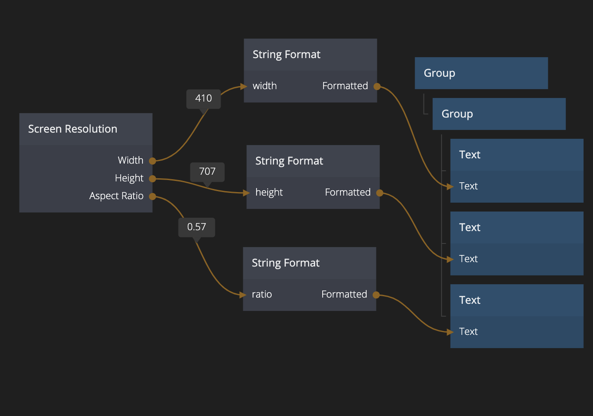

<##head##>

# Screen Resolution

This node outputs the width, height and aspect ratio of the display area in CSS pixels.

<##head##>

## Outputs

**Width**
The width of the display area in pixels.

**Height**
The height of the display area in pixels.

**Aspect Ratio**
The width divided by the height.

