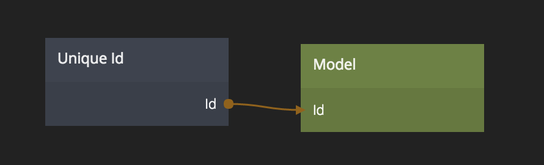

<##head##>

# Unique Id

This node generates a unique ID, something that is very useful when storing data in a backend like Noodl Cloud Services.

Generating a unique ID for every entity in the database means that it can easily be retrieved and referenced, no matter what the content is.

<##head##>

## Inputs

**New**
Set the Id output to a new unique id.

## Outputs

**Id**
The current id generated by this node.

 

