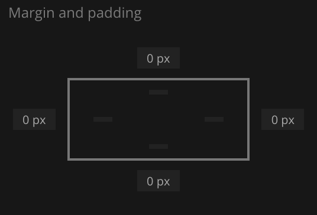
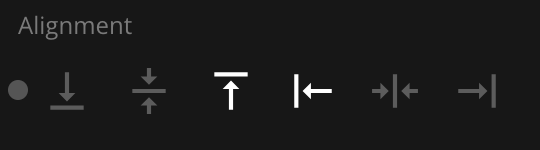
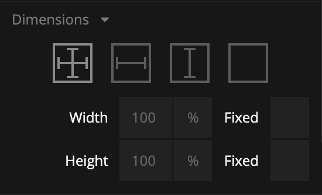
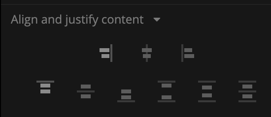

# Visual Properties

All visual nodes feature a plethora of visual properties that can be accessed both in the Property Panel and through inputs. These are documented below. Plese refer to the individual node documentation pages to see which nodes feature what visual properties.

## Margin

Margins are the spacings around the node, outside of the borders. The margins for the node can be set individually in the Spacing Gadget.

| Property        | Description                                             |
| --------------- | ------------------------------------------------------- |
| _Margin Left_   | The left margin in `px`, or `%` of the parents width.   |
| _Margin Right_  | The right margin in `px`, or `%` of the parents width.  |
| _Margin Top_    | The top margin in `px` or, `%` of the parents width.    |
| _Margin Bottom_ | The bottom margin in `px`, or `%` of the parents width. |

## Padding

Paddings are the spacings around the nodes content, inside of the borders. The margins for the node can be set individually in the Spacing Gadget.

| Property         | Description                                              |
| ---------------- | -------------------------------------------------------- |
| _Padding Left_   | The left padding in `px`, or `%` of the parents width.   |
| _Padding Right_  | The right padding in `px`, or `%` of the parents width.  |
| _Padding Top_    | The top padding in `px` or, `%` of the parents width.    |
| _Padding Bottom_ | The bottom padding in `px`, or `%` of the parents width. |

## Alignment

To specify how the node is aligned to its parent you can use the Alignment Gadget.

From left to right, the alignment options are:

| Property                  | Description                                             |
| ------------------------- | ------------------------------------------------------- |
| _Align Bottom_            | Align this node to the bottom of its parent.            |
| _Align Vertical Center_   | Align this node to the bottom of its parent.            |
| _Align Top_               | Align this node to the top of its parent.               |
| _Align Left_              | Align this node to the left side of its parent.         |
| _Align Horizontal Center_ | Align this node to the horizontal center of its parent. |
| _Align Right_             | Align this node to the right of its parent.             |

## Dimensions

Controling the width and height of the node is done with the Dimension Gadget.

The first four controls the **Size Mode** of the node. It decides how the width and height of the node is specified. From left to right, the options are:

| Size Mode                        | Description                                                                                                                                 |
| -------------------------------- | ------------------------------------------------------------------------------------------------------------------------------------------- |
| _Explicit width and height_      | Set the width and height directly in pixels or percentage. Percentage is in relation to the parent, so 100% is the same size as the parent. |
| _Explicit height, Content Width_ | The node will calculate the width to fit all of its children. The height is explicitly set.                                                 |
| _Explicit width, Content Height_ | The node will calculate the height to fit all of its children. The width is explicitly set.                                                 |
| _Content Size_                   | Both the width and the height is calculated to fit all of the node's children.                                                              |

The other paroperties are:

| Property | Description                                                                                                                                                                                                                                                                                                         |
| -------- | ------------------------------------------------------------------------------------------------------------------------------------------------------------------------------------------------------------------------------------------------------------------------------------------------------------------- |
| _Width_  | Specify the width of this node in pixels, percentage of parent's width or the unit `vw` which is percentage of the browser window width.                                                                                                                                                                            |
| _Height_ | Specify the height of this node in pixels, percentage of parent's height or the unit `vw` which is percentage of the browser window height.                                                                                                                                                                         |
| _Fixed_  | Controls if an element will try to resize and share space with siblings without going outside of the bounds of the parent.    If _Fixed_ is enabled, the element will be the exact specified size. If it is disabled, the element will resize to fill up empty space, or shrink to make space for siblings. |

You can use the [Dimenson Contstraints Gadget](#dimension-constraints) to set a min and/or a max size for the node.

## Layout

The supported properties of the Layout Gadget can be very different depending on the node. All possible properties are listed below.

### • Position

Controls the layout of this node is in its parent group.

| Option      | Description                                                                                                                                                                                                                       |
| ----------- | --------------------------------------------------------------------------------------------------------------------------------------------------------------------------------------------------------------------------------- |
| _In Layout_ | This node is part of the parent group layout, it will be stacked with its siblings depending on the parent group layout settings.                                                                                                 |
| _Absolute_  | This node will not be part of the parent group layout, instead you are free to use the `Pos X` and `Pos Y` to place this node explicitly.                                                                                         |
| _Sticky_    | Behaves like _In Layout_, except when the node is about the be scrolled outside the parent. It'll stick to an edge of the parent instead of scrolling away. The edge it sticks to can be controlled with the **Alignment** input. |

### • Layout Direction

By default all children are stacked. This property specifies the stacking direction.

| Option       | Description                        |
| ------------ | ---------------------------------- |
| _Vertical_   | Children are stacked vertically.   |
| _Horizontal_ | Children are stacked horizontally. |
| _None_       | Children are not stacked.          |

### • Multi Line Wrap

This property specifies what happens with children that are stacked outside of the border of the node.

| Option       | Description                                                                                            |
| ------------ | ------------------------------------------------------------------------------------------------------ |
| _Off_        | Children are stacked beyond the boundaries of the node. If _Clip_ is enabled they will not be visible. |
| _On_         | Children are wrapped to the next row or column (depending on layout direction).                        |
| _On Reverse_ | Same as _On_ but opposite layout direction.                                                            |

### • Clip content

This property controls if elements that are too big to fit inside the node will be clipped.

If disabled, a group will always expand to contain all of its children. So if the children are taller than the size of the group, the group will expand and be larger than its specified size.

## Align and justify content

This Gadget controls how children are aligned and justified by default. Children can override these settings with their **Alignment** input.

The first set of options control cross-axis alignment, meaning vertical alignment for horizontal layouts, and horizontal alignment for vertical layouts. From left to right, the options are:

| Option               | Description                                       |
| -------------------- | ------------------------------------------------- |
| _Align items start_  | Children are stacked at the start of the parent.  |
| _Align items center_ | Children are stacked at the center of the parent. |
| _Align items end_    | Children are stacked at the end of the parent.    |

The second set of options control alignment in the same direction as the layout. From left to right, the options are:

| Option                          | Description                                                                                         |
| ------------------------------- | --------------------------------------------------------------------------------------------------- |
| _Justify content start_         | Children are stacked at the start of the parent.                                                    |
| _Justify content center_        | Children are stacked at the center of the parent.                                                   |
| _Justify content end_           | Children are stacked at the end of the parent.                                                      |
| _Justify content space between_ | Children are evenly distributed. No space is added between the parent and the first and last child. |
| _Justify content space around_  | Children are evenly distributed. Space is added between the parent and the first and last child.    |
| _Justify content space evenly_  | Children are evenly distributed with equal space between them.                                      |

## Scroll

This Gadget controls how scrolling should be handled within the node.

| Property        | Description                                                                                                                                                                                                                                              |
| --------------- | -------------------------------------------------------------------------------------------------------------------------------------------------------------------------------------------------------------------------------------------------------- |
| _Enable Scroll_ | This specifies if the node should have scrolling enabled for children that overflow outside of the nodes boundaries. Scrolling direction is determined by the nodes [Layout](#layout) direction. Enabling this will show the scrolling properties below. |

| Property                 | Description                                                                                                                                                                                                  |
| ------------------------ | ------------------------------------------------------------------------------------------------------------------------------------------------------------------------------------------------------------ |
| _Native Platform Scroll_ | When enabled, uses the web's native scrolling dependent on the platform. Uses custom Noodl scrolling when disabled. The custom Noodl scrolling is platform independent and has both touch and mouse support. |
| _Show Scrollbar_         | Only available if _Native Platform Scroll_ is disabled. Toggles the visibility of the scrollbar.                                                                                                             |
| _Bounce at boundaries_   | Only available if _Native Platform Scroll_ is disabled. Toggles if scrolling bounces when you are at top or bottom of list.                                                                                  |
| _Snap_                   | Only available if _Native Platform Scroll_ is disabled. Enabling this will snap the scrolling between every screen.                                                                                          |
| _Snap To Every Item_     | Only available if _Snap_ is enabled. Enabling this will force the scrolling to snap to individual items.                                                                                                     |

## Style

This Gadget controls basic styling of the node.

| Property           | Description                                                                                                                                                                                                                                                                                            |
| ------------------ | ------------------------------------------------------------------------------------------------------------------------------------------------------------------------------------------------------------------------------------------------------------------------------------------------------ |
| _Opacity_          | The opacity of the node. 0 is completely transparent and invisible. 1 is completely solid and opaque.                                                                                                                                                                                                  |
| _Background Color_ | Specifies the background color for this node.                                                                                                                                                                                                                                                          |
| _Visible_          | Toggle the visibility of this node on and off.                                                                                                                                                                                                                                                         |
| _zIndex_           | The depth index for this node, this can be any number.                                                                                                                                                                                                                                                 |
| _Blend Mode_       | Controls how this element should blend with the elements behind it. The blend mode can be set to one of the following: `Multiply` `Normal` `Screen` `Overlay` `Darken` `Lighten` `Color Dodge` `Color Burn` `Hard Light` `Soft Light` `Difference` `Exclusion` `Hue` `Saturation` `Color` `Luminosity` |

## Border Style

The Border Style Gadget is used to style the borders.

You can select to style all borders at once, or only style individual borders. The styling for the individual borders will override the all-borders option.

| Property       | Description                                                                                                                            |
| -------------- | -------------------------------------------------------------------------------------------------------------------------------------- |
| _Border Style_ | Specifies whether this node should have a border and what it should look like. The options are `None`, `Solid`, `Dotted` and `Dashed`. |
| _Border Width_ | The width of the border. Only available if _Border Style_ is set to have a border.                                                     |
| _Border Color_ | The color of the border. Only available if _Border Style_ is set to have a border.                                                     |

## Corner Radius

The Corner Radius Gadget is used to round the corners of the node.

You can select to set the corner radius all corners at once, or only style individual corners. The styling for the individual corners will override the all-corners option.

The corner radius is specified in `px` or `%` of the nodes width.

## Box Shadow

You use the Box Shadow Gadget to set the shadow behind or inside of the node.

| Property         | Description                                                                                                                                                         |
| ---------------- | ------------------------------------------------------------------------------------------------------------------------------------------------------------------- |
| _Shadow Enabled_ | Enables and disables the shadow.                                                                                                                                    |
| _Offset X_       | The horizontal offset of the shadow. A positive value puts the shadow on the right side of the node, a negative value puts the shadow on the left side of the node. |
| _Offset Y_       | The vertical offset of the shadow. A positive value puts the shadow below the node, a negative value puts the shadow above node.                                    |
| _Blur Radius_    | The blur radius. The higher the number, the blurrier the shadow will be.                                                                                            |
| _Spread Radius_  | The spread radius. A positive value increases the size of the shadow, a negative value decreases the size of the shadow.                                            |
| _Inset_          | Changes the shadow from an outer shadow (outset) to an inner shadow.                                                                                                |
| _Shadow Color_   | The color of the shadow.                                                                                                                                            |

## Placement

The Placement Gadget lets you offset, rotate and scale the node. It uses CSS Transforms under the hood, meaning that the nod will still take up the original size and position in the visual tree.

| Property             | Description                                                                                                                                                                                                                                              |
| -------------------- | -------------------------------------------------------------------------------------------------------------------------------------------------------------------------------------------------------------------------------------------------------- |
| _Pos X_              | The X position of the node. Either relative to its parent top left corner or relative to its layout position depending on the _Position_ property. Can be specified in pixels or as a percentage of its parent's width.                                  |
| _Pos Y_              | The Y position of the node either relative to its parent's top left corner or relative to its layout position depending on the _Position_ property. Can be specified in pixels or as a percentage of its parent's height.                                |
| _Rotation_           | The rotation in degrees.                                                                                                                                                                                                                                 |
| _Scale_              | Specifies scaling of this node. A value of 0 scales the node down completely so that it is no longer be visible. A value of 1 gives it the original size, and a value of 2 doubles the size and so on.                                                   |
| _Transform Origin X_ | Specifies the X position, within this node, that will be the center for rotation and scale. By default it is the center of the node (i.e. 50%) but you can specify an arbitrary value in either percentage of the node's width or explicitly in pixels.  |
| _Transform Origin Y_ | Specifies the Y position, within this node, that will be the center for rotation and scale. By default it is the center of the node (i.e. 50%) but you can specify an arbitrary value in either percentage of the node's height or explicitly in pixels. |

## Dimension Constraints

The Dimension Constraints Gadget allows you to clamp the values of the [Dimensions Gadget](#dimensions).

| Property     | Description                                                                                                                                               |
| ------------ | --------------------------------------------------------------------------------------------------------------------------------------------------------- |
| _Min Width_  | The minimum width that can be assumed by growing with children or parent. Can be specified in % or pixels, or _vw_ which is percentage of window width.   |
| _Max Width_  | The maximum width that can be assumed by growing with children or parent. Can be specified in % or pixels, or _vw_ which is percentage of window width.   |
| _Min Height_ | The minimum height that can be assumed by growing with children or parent. Can be specified in % or pixels, or _vh_ which is percentage of window height. |
| _Max Height_ | The maximum height that can be assumed by growing with children or parent. Can be specified in % or pixels, or _vh_ which is percentage of window height. |

## Other

| Property                 | Description                                                                                                                                                                                                                                               |
| ------------------------ | --------------------------------------------------------------------------------------------------------------------------------------------------------------------------------------------------------------------------------------------------------- |
| _Pointer Events Mode_    | This specifies how this node responds to pointer events.  `Inherit` sets the node to respond to pointer events in the same way as its parent. `Explicit` sets the node to respond to pointer events as specified by _Pointer Events Enabled_. |
| _Pointer Events Enabled_ | This property is only available if _Pointer Events Mode_ is set to _Explicit_. It will specify if this node responds to pointer events or not. If set to false this node will completely ignore pointer events.                                           |
| _Block Pointer Events_   | This will cause this node to block all pointer events, e.g. any node that is behind this node will not receive pointer events.                                                                                                                            |
| _Mounted_                | This property is used to completely remove the node from the DOM. If this property is set to false the node is removed from the visual tree. It differs from the _Visible_ property where the node is still part of the visual tree but invisible.        |

## Advanced Style

| Property    | Description                                                             |
| ----------- | ----------------------------------------------------------------------- |
| _CSS Class_ | <##input:cssClass##>Specify a CSS class this node will have.<##input##> |
| _CSS Style_ | Use this property to specify your custom CSS.                           |
