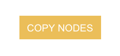
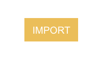

# Snippets

Here you will find small and useful guides on how to solve a specific task in Noodl, we call them **Snippets**.

These snippets can include small Noodl node graphs that you can copy and paste into your project. If you see button bellow, You can click it to copy the nodes shown on the accompanying image to your clipboard, and then paste them into your project in Noodl.

Some snippets might be to big for copy/pasting, so if you encounter the "Import" button shown bellow, click it to import a module and/or components into Noodl. You can either do this into an existing project or create a new project. (it's often specific if the import is something you should put in your existing project).

Remember, if you have questions that aren't covered here, you can always join the conversation on [Discord](https://discord.gg/umRupsc2f5).

<table class="shortcut_list">
    <tr>
        <td></img></td>
        <td><a href="#/snippets/star-rating/">Star Rating component</a> A Star Ratings component.</td>
    </tr>
     <tr>
        <td></img></td>
        <td><a href="#/snippets/multi-select/">Multi select</a> An example of a multi select drop down with checkboxes.</td>
    </tr>
    <tr>
        <td></img></td>
        <td><a href="#/snippets/checkbox-group/">Checkbox Group</a> An example of a dynamically generated checkbox group.</td>
    </tr>
    <tr>
        <td></img></td>
        <td><a href="#/snippets/javascript/pointer-position.md">Pointer Position</a> This example will attach an event listener to the body element of the web page, and listen for mousemove.</td>
    </tr>
    <tr>
        <td></img></td>
        <td><a href="#/snippets/javascript/get-dom-element.md">Get DOM Element</a> Get access to the underlying DOM element and use the browser APIs directly.</td>
    </tr>
    <tr>
        <td></img></td>
        <td><a href="#/snippets/ui/importing-font-files.md">Importing font files</a> A quick guide for how you can import font files locally stored on your computer.</td>
    </tr>
     <tr>
        <td></img></td>
        <td><a href="#/snippets/ui/importing-css-fonts.md">Importing CSS fonts</a> a quick guide on how to use fonts via CSS.</td>
    </tr>
     <tr>
        <td></img></td>
        <td><a href="#/snippets/ui/horizontal-cards-list.md">Horizontal list of cards</a> A guide on how to create a horizontal list of cards with snapping.</td>
    </tr>
     <tr>
        <td></img></td>
        <td><a href="#/snippets/rotary-knob/rotary-knob.md">Rotary Knob</a> an example of how to use the Script node to implement a simple rotary knob.</td>
    </tr>
    <tr>
        <td></img></td>
        <td><a href="#/snippets/responsive/media-query.md">Media Queries</a> An example on how to import and use Media Queries in your own applications.</td>
    </tr>
    <tr>
        <td></img></td>
        <td><a href="#/snippets/p5-canvas/p5-canvas.md">P5.js Canvas Intergration</a> An example on how to set up a p5.js sketch inside of Noodl</td>
    </tr>
    <tr>
        <td></img></td>
        <td><a href="#/snippets/shake-detector/shake-detector.md">Shake Detector</a> Detect when a mobile phone is being shaked</td>
    </tr>
    <tr>
        <td></img></td>
        <td><a href="#/snippets/image-from-video/image-from-video.md">Image from Video Stream</a> Capture and display images from a video stream in Noodl</td>
    </tr>
</table>
