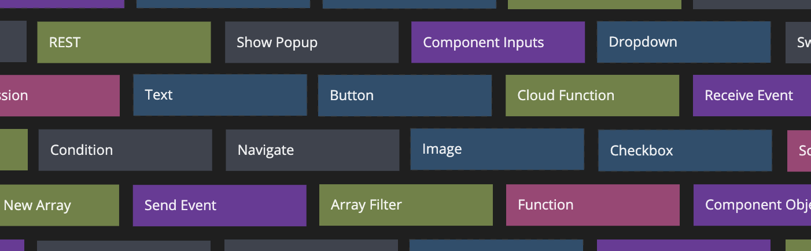
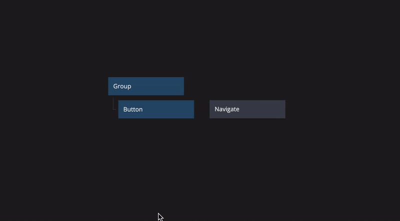
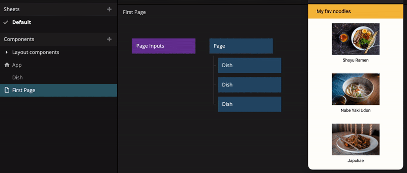

# Basic concepts

Noodl is a low code web app builder that will have you creating applications faster and smarter. It's mixing visual development with simple Javascript, but you don't need any previous coding experience to start learning. 

<iframe width="100%" height="100%" src="https://www.youtube.com/embed/1n0MXSbmTQk" style="position:absolute;top:0;left:0; frameborder="0" allow="accelerometer; autoplay; encrypted-media; gyroscope; picture-in-picture" allowfullscreen></iframe>
</iframe>

## Nodes

The main building blocks of Noodl are nodes. Every node has its own specific purpose and is very simple in itself, but together they become really powerful.

Some nodes are visual elements such as UI controls, others perform actions such as writing to the database.

### Inputs and outputs

All nodes have inputs and outputs. Connecting two nodes is as easy as clicking one node, dragging the connection to another node and selecting what output should be connected to what input. You can visually see the data flow in the Node Editor, and clicking a connection allows you to see what data is being passed.

### Connection types

Noodl has two different connection types, Data and Signals.

-   Data: We use Data connections when passing along information from one node to another. This can be anything from a value from an input field to the value of a variable or the result of a calculation.

-   Signal: Some nodes have signal outputs. Nodes can emit signals on an output when an event occurs such as when a button is clicked. Other nodes have signal inputs which usually triggers some sort of action. This could be anything from submitting form data when clicking a button to showing a popup.

### Type conversion

You can not connect Data and Signals directly to one another, but there are nodes that can convert the connection types, for example if you want to trigger a signal whenever a value changes.

## Components

The best way to use nodes is to combine them into Components. These Components act as our own custom nodes with their own inputs and outputs. This is a great way of reusing UI or logic across your application.

### Component types

There are three types of components: Page, Visual and Logic.

-   `Page`: Page components are your app’s screens and can be navigated to using Page Router nodes.

-   `Visual`: Visual components are made to group and render your UI elements on the screen. They can contain logic, but the main output is always something visible.

-   `Logic`: Logic components are the brains of your app. They are used to group nodes that don’t render anything on screen. It can be as simple as a couple of nodes that do data transformation to something more complex, like routing signals to different outputs based on passed values.

### Update everywhere

One very practical thing with Components is that they are global, meaning that whenever you update a component's internals, these changes will be updated everywhere this component is used in the app.

## Low coding
Noodl has enough abstracted, high level nodes to keep you productive while providing you with enough low level nodes to make it flexible enough to granularly solve most problems in the way you see fit. You can create most basic functinality and UI in your application without resorting to use code.

But you can at any time easily insert Javascript code using the [Function](nodes/javascript/function/) and [Script](nodes/javascript/script/) nodes. These provide a simple way to write code for solving most things where the built in node doesn't suffice. You do not need to be a Javascript expert, a very basic knowledge of programming will suffice, or you can pick it up as you learn. 

## Extendability

If you are a professional developer and would like to extend Noodl with your own core nodes, take a look at building a [Module](extending/) using the Noodl SDK.

## Version control

Noodl also features built-in [version control](guides/version-control/) powered by Git (it's what the cool kids use), letting you keep track of your changes, and easily collaborate even as your team scales.

## Get Noodling!

In short Noodl is a great tool for anyone looking for flexibility, scalability and quick iterations. We built it as a tool that grows with you and your needs, and that supports you in every step from prototype to production. We hope you will enjoy Noodling as much as we do.
