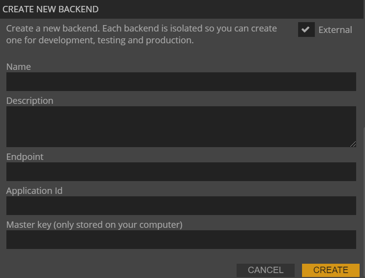

# Deploying the backend service to AWS

## What you will learn in this guide
This guide will show you how to deploy an external Noodl Backend, running as a **Docker Container** on Amazon Web Service (AWS).

## Overview

The guide will take you through the following steps
* Set up an AWS account
* Set up AWS Copilot
* Create a Dockerfile
* Instruct GCP to build a **Docker** image containing your Backend
* Instruct GCP to run the container

To follow this guide you are first recommended to go through the [Using an External Backend](/guides/deploy-noodl-apps/using-external-backend.md) guide first.

## Setting up an AWS account

First you need to setup an [AWS account](https://aws.amazon.com/) if you don't have one already. You will need to provide your credit card details but AWS has a free tier that will be more than enough to get started.

**AWS CLI**  
Next you must install and setup the AWS command line interface tool. You can find the installation instructions [here](https://docs.aws.amazon.com/cli/latest/userguide/install-cliv2.html). Following the installation you must configure the CLI so that it points to your AWS account:

```bash
aws configure
```

You will need to fetch your credentials for your AWS account to complete this step. You can follow this [guide](https://docs.aws.amazon.com/sdk-for-javascript/v2/developer-guide/getting-your-credentials.html) if you don't know how.

## Setting up an AWS Copilot  
Now you must install a second CLI that will help you manage the services that you spin up in the AWS cloud. You can find instructions for installing the tool [here](https://docs.aws.amazon.com/AmazonECS/latest/developerguide/AWS_Copilot.html#copilot-install). You can find more information on the copilot CLI [here](https://aws.github.io/copilot-cli/)

Ok great, now with the tools in place we can start the deployment of our backend service image. First we need to initialise using *copilot*, run the following in the *my-noodl-server* folder.

## Creating a Dockerfile for your Backend

Create a new folder. In that folder create a new file named `config.json`. Paste the content below into it and make sure to fill it out with the correct settings for your project. see the [Using an External Backend](/guides/deploy-noodl-apps/using-external-backend.md) guide for more info on what they mean.

```bash
{
    "appId": <PARSE_SERVER_APPLICATION_ID>,
    "masterKey": <PARSE_SERVER_MASTER_KEY>,
    "databaseURI": <PARSE_SERVER_DATABASE_URI>
}
```

In the command above you specify three environment variables for your new web services, these are important and are as follows:

* **PARSE_SERVER_APPLICATION_ID** needs to be an id for your application, you can really choose any but keep it simple. You will provide this in Noodl later to connect to your backend.

* **PARSE_SERVER_MASTER_KEY** is a secret key (password) that will give you full admin access to your backend and database. Keep it safe. You will need it when connecting to your backend from Noodl and use the dashboard. A string of random characters is generally a good choice.

* **PARSE_SERVER_DATABASE_URI** this is the URI you fetched from the MongoDB cluster you spun up for the backend. 

Save the file. Then create another file called `Dockerfile`. Paste the following content into it and save.

```bash
FROM parseplatform/parse-server

COPY config.json config.json

EXPOSE 1337

CMD ["config.json"].
```

In the same folder, open a Terminal window and run the following command.

```bash
copilot init --app my-noodl-app --name my-noodl-server --type 'Request-Driven Web Service' --dockerfile './Dockerfile'
```

* You will be promted to deploy a test environment, make sure you answer **no** to that for now. There are a few things we need to sort out first.

This command will initialize the needed infrastructure to run your containers in the cloud. It will also create a folder called *copilot* that will contain settings files for all your services. You will also find a subfolder in *copilot* called *my-noodl-server* and in that folder a file called *manifest.yml*. You are going to need to edit the default values in that file. The content of the file should be this:

```yml
name: my-noodl-server
type: Request-Driven Web Service

image:
  build: Dockerfile
  port: 1337

http:
  healthcheck:
    path: /parse/health
    healthy_threshold: 3
    unhealthy_threshold: 5
    interval: 10s
    timeout: 5s

cpu: 1024
memory: 2048

```

Before saving this file you will need to update the variables at the end of the file, these are important and should be as follows:

Great work, now there is only one step left to get this show on the road. In the same folder as before, run the following to deploy the backend service.


```bash
copilot deploy
```

That's it, after a few minutes of spinning all necessary services up in the cloud you will be provided with the endpoint URL for your backend service. Make note of that as you will need it later.

The URL you get from AWS is one of their generated URLs, it will work just fine but sometimes it's better to setup your own domain. For that you can follow [these](https://docs.aws.amazon.com/apprunner/latest/dg/manage-custom-domains.html) instructions.

## Hooking the backend up to your application

With your brand spanking new backend service up and running you can give it a quick test with the follow command (if you are on Mac or Linux):

```bash
curl https://<your-endpoint-for-the-backend-service>/parse/health
```

It should reply with the following if everything is up and running as it should be (it might take a short while the first time you call this endpoint as it spins up the container on demand):

```bash
{"status":"ok"}
```

Now let's connect it to our Noodl application. You need a new external backend with a different endpoint than when you tried your local docker image. Insert the correct endpoint.

<div class="ndl-image-with-background l">



</div>

After you have created the backend, now you can make it the default backend for your project. Click *Use as project backend*

<div class="ndl-image-with-background l">


</div>

Now it will work just like the built in Noodl backends, you can open the dashboard and manage the data in the backend just like you are used to but the data is kept in your new database and the backend service is managed and scaled by your cloud provider.
