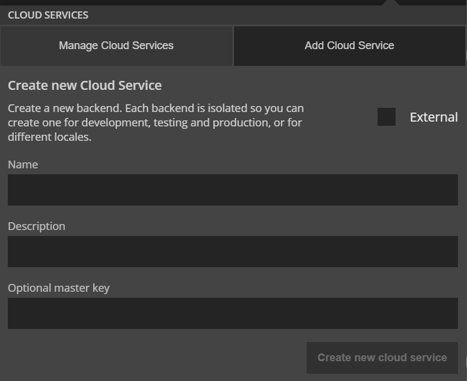
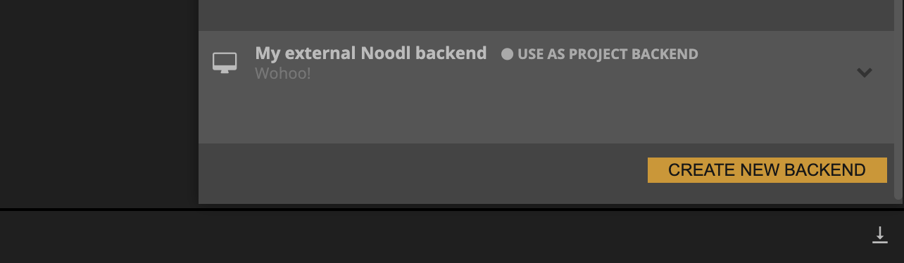

# Deploying the backend service to GCP 

## What you will learn in this guide
This guide will show you how to deploy an external Noodl Backend, running as a **Docker Container** on Google Cloud Platform (GCP).

## Overview

The guide will take you through the following steps
* Login to your GCP account
* Find the *project id* of your project
* Instruct GCP to build a **Docker** image containing your Backend
* Instruct GCP to run the container
* Test the Backend

To follow this guide you are first recommended to go through the [Using an External Backend](/guides/deploy-noodl-apps/using-external-backend.md) guide first.

## Signing up and logging into GCP

First you need to [sign up for GCP](https://cloud.google.com/), here you will need to provide your credit card details but Google provides a chunk of free credits that will be more that enough to get you started. You will also need to install the command line tool for GCP you can find the instructions [here](https://cloud.google.com/sdk/docs/install). After you have installed it make sure you authenticate with your google account. Run the following in a console.

```bash
gcloud auth login
```

Make sure you find the *project id* for your project in GCP. You can find it in the GCP dashboard of your project.


## Building the Container Image
When you have the *project id* at hand you can build the container image in the cloud and it will be available to spin up a web service in GCP.

Create a new folder. In that folder create a new file named `config.json`. Paste the content below into it and make sure to fill it out with the correct settings for your project. see the [Using an External Backend](/guides/deploy-noodl-apps/using-external-backend.md) guide for more info on what they mean.

```bash
{
    "appId": <PARSE_SERVER_APPLICATION_ID>,
    "masterKey": <PARSE_SERVER_MASTER_KEY>,
    "databaseURI": <PARSE_SERVER_DATABASE_URI>
}
```

In the command above you specify three environment variables for your new web services, these are important and are as follows:

* **PARSE_SERVER_APPLICATION_ID** needs to be an id for your application, you can really choose any but keep it simple. You will provide this in Noodl later to connect to your backend.

* **PARSE_SERVER_MASTER_KEY** is a secret key (password) that will give you full admin access to your backend and database. Keep it safe. You will need it when connecting to your backend from Noodl and use the dashboard. A string of random characters is generally a good choice.

* **PARSE_SERVER_DATABASE_URI** this is the URI you fetched from the MongoDB cluster you spun up for the backend. 

Save the file. Then create another file called `Dockerfile`. Paste the following content into it and save.

```bash
FROM parseplatform/parse-server

COPY config.json config.json

EXPOSE 1337

CMD ["config.json"].
```
In the same folder run the following command in your *my-noodl-server* folder.

```bash
gcloud builds submit --tag gcr.io/<PROJECT-ID>/my-noodl-server
```

When the build is complete you can deploy a web service with the following command (don't forget to replace *PROJECT-ID* as above)

```bash
gcloud run deploy --image gcr.io/<PROJECT-ID>/parse-server
```

After you run the command you will be prompted to provide the following information:

* The name of the service (just press enter to accept *my-noodl-server*)

* The region, make sure it's the same as where your database cluster.

* Make sure you answer **y** to **allow unauthenticated invocations**.

After a few minutes it will complete and you will have the URL for a working Noodl backend! Wohoo! With this URL and your application id you can connect to your backend from Noodl. 

You will get a generated URL from the Google Run service, if you prefer you can hook it up to your own custom domain by following [this](https://cloud.google.com/run/docs/mapping-custom-domains) guide.

## Hooking the backend up to your application

With your brand spanking new backend service up and running you can give it a quick test with the follow command (if you are on Mac or Linux):

```bash
curl https://<your-endpoint-for-the-backend-service>/parse/health
```

It should reply with the following if everything is up and running as it should be (it might take a short while the first time you call this endpoint as it spins up the container on demand):

```bash
{"status":"ok"}
```

Now let's connect it to our Noodl application. You need a new external backend with a different endpoint than when you tried your local docker image. Insert the correct endpoint.

<div class="ndl-image-with-background l">



</div>

After you have created the backend, now you can make it the default backend for your project. Click *Use as project backend*

<div class="ndl-image-with-background l">



</div>

Now it will work just like the built in Noodl backends, you can open the dashboard and manage the data in the backend just like you are used to but the data is kept in your new database and the backend service is managed and scaled by your cloud provider.
