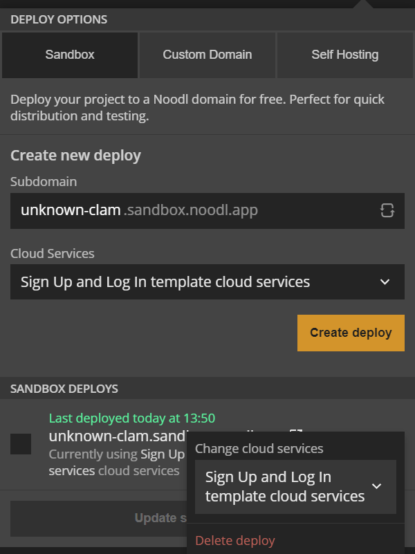

# Deploy an App to the Sandbox domain, `*.noodl.app`

## What you will learn in this guide
This guide will teach you how to deploy a Noodl App to the Noodl Sandbox, i.e the `noodl.app` domain.
You can use this to share your Noodl App with other people.

## Overview
There are multiple ways for you to deploy Noodl Apps so other people can use them. The easiest one is to use the Noodl Sandbox deployment. The your app will get a public URL that ends with `.noodl.app`.

## Doing a Sandbox Deployment
Open the project you want to deploy. Then click the **Deploy** button on the top right.

In the popup that opens, you can select a subdomain name. Your URL will become `<subdomain>.noodl.app`. Note that some subdomains may be taken by other users, so be ready to come up with a unique name if that's the case.

## Managing your Sandbox Deployments
Once you have deployed your app they will be available in the list of Sandbox Deployments.

You can select any of the sandbox deploys and change which backend to use or to **Delete** the deploys.