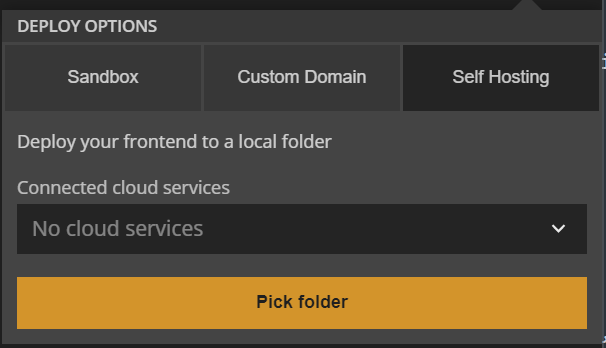

# Hosting your Noodl Frontend at GCP or AWS

## What you will learn in this guide
In this guide you will learn how to deploy your Noodl App frontend to a local folder and then host it on either Google Cloud Platform or AWS. This is needed if you want to host your Noodl App frontend in your own cloud infrastructure and with your own domain name.

?>**Enabling Deploy to Folder** Note: To be able to follow this guide you must have "Deploy to Folder" feature enabled. This is not available by default in Noodl. You can enable it by submitting [this form](https://www.noodl.net/deploy-to-folder).

## Overview

In Noodl You can deploy your application to a **noodl.app** domain for free. See [this](deploy-noodl-dot-app.md) guide for more information.

However, if you want to use your own custom domain, or if you want features like faster globalized delivery via CDNs etc, you may want to host your frontend somewhere else. For this you will first deploy it locally and then upload it to your hosting provider of choice.

## Deploying to Local Folder
By using the *deploy to folder* section Noodl will save a version of your frontend to a folder on your local machine, this folder will contain everything needed and you can simply upload the content to your hosting service.

## Hosting your Frontend at GCP or AWS

* **Google Cloud Platform** If you would like use GCP to host the frontend you can follow this [guide](https://cloud.google.com/storage/docs/hosting-static-website). There you will create a bucket, a load balancer and a CDN.

* **Amazon Web Services** If you prefer to use AWS you can watch this [video](https://www.youtube.com/watch?v=BpFKnPae1oY&ab_channel=AmazonWebServices) it will explain how to create an S3 bucket and how to route traffic using the AWS DNS service, Route 53.
