# Scrolling Content

## What you will learn in this guide
This guide will teach you the basics on how to make content larger than its container visible through scrolling. We will mainly make use of the **Scrolling** property on the [Group](/nodes/ui-elements/group/) node and go into detail on how the layout engine works in relation to scrolling. We will also look at the built in scrolling functionality in the [Page Router](nodes/navigation/page-router/) that makes it easy to build pages with scrollable content.

## Overview

The guides will walk through the following topics

* How the **Group** node gets it size
* Scrolling in the **Group** node
* Scrolling in the **Page Router** node.
* `Sticky` Layout Position in a scrolling **Group**

This guide will use the [Repeater](/nodes/ui-elements/repeater/) node to create lists and also touch on navigation using the [Page Router](/nodes/navigation/page-router/). So it's recommended to check out the guides for them either before or after following this guide.

* [List Basics Guide](/guides/lists/list-basics/)
* [Web Navigation Guide](/guides/navigation/web-navigation/basic-navigation/)

You should also be familiar with layout basics so check out [this](/guides/layouts/layout-basics/) guide before you start this guide, if you haven't already.

## Scrolling in the Group node
The **Group** node is the fundamental node to create a layout. So what happens if the children of a **Group** node takes up more space than what's available?
Well, it depends on how you set up its sizing.

### The size of the Group node

On a high level there are two options (in both horizontal and vertical dircetion):

1) Size is explicitly set. The size can then be given in % of available space, pixels or vw
2) Size is decided by the total size of its children

<div class="ndl-image-with-background">

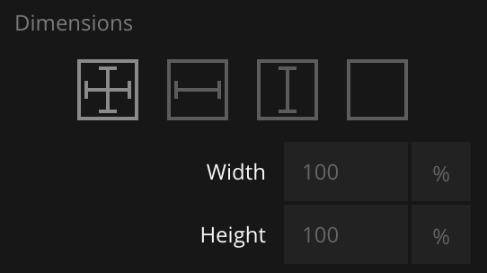

</div>

So we only need to worry about case 1), what happens if the children takes up more than the space that you give them in the Group?
Let's try it. Start a new project, for example using the "Hello World" template. Replace the current nodes with the ones below.

<div class="ndl-image-with-background">

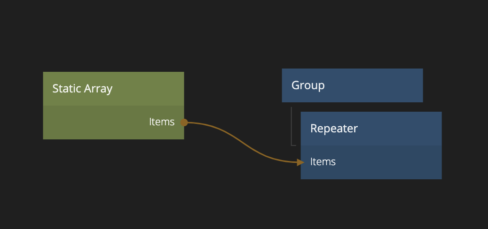

</div>

Fill up the **Static Array** node with some data. Make sure its set to `JSON` format.

<div class="ndl-image-with-background">

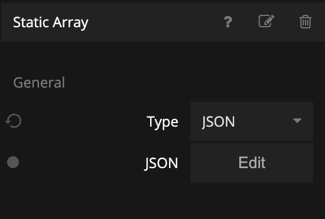

</div>

Then copy and paste the data below into the **Static Array**.

```json
[
    {"label":"item 1"},
    {"label":"item 2"},
    {"label":"item 3"},
    {"label":"item 4"},
    {"label":"item 5"},
    {"label":"item 6"},
    {"label":"item 7"},
    {"label":"item 8"},
    {"label":"item 9"},
    {"label":"item 10"},
    {"label":"item 11"},
    {"label":"item 12"},
    {"label":"item 13"},
    {"label":"item 14"},
    {"label":"item 15"},
    {"label":"item 16"},
    {"label":"item 17"},
    {"label":"item 18"},
    {"label":"item 19"},
    {"label":"item 20"}
]
```

Then create a new visual component and call it "List Item".

<div class="ndl-image-with-background">

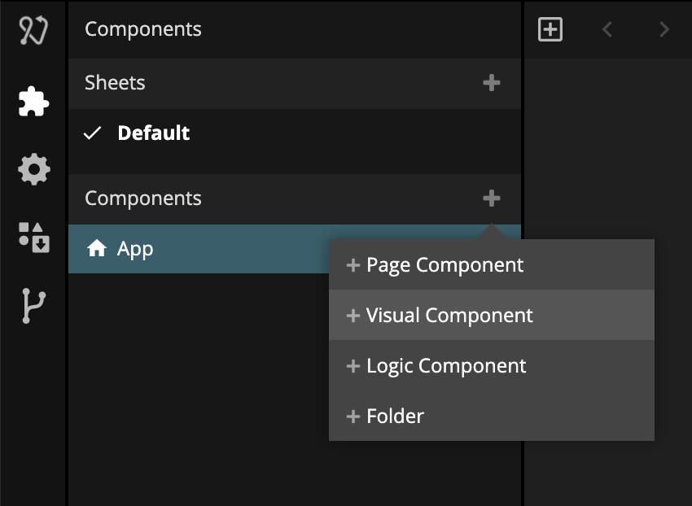

</div>

And create the following node structure:

<div class="ndl-image-with-background">

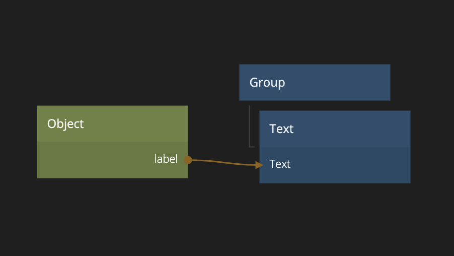

</div>

Make sure the **Object** node has a property called `label` connected to the **Text** node. Also set the size of the **Group** node to 100% width, and 45 px height. Give it a 5 px margin at the bottom. Also give it a outline so we can see it properly.
Center align the **Text** node vertically.

Finally go back to the "App" component and select the newly created list item as the **Template**.

You will now have something that looks like below. (You can also import the project directly by clicking "Import" below).

<div class="ndl-image-with-background m">
    </img>
<button class="ndl-import-button" onClick='importIntoNoodl("guides/layouts/scrolling/step-1.zip",{name:"Scrolling Part 1",thumb:"guides/layouts/scrolling/result-1.png"})'></button>
</div>

As you can see, the list takes up the full screen and unless you have a veeeeery long screen the items will flow outside the screen. You are not able to scroll the content.

Also try to change the vertical size of the **Group** node in the main App to `50%`.

<div class="ndl-image-with-background l">

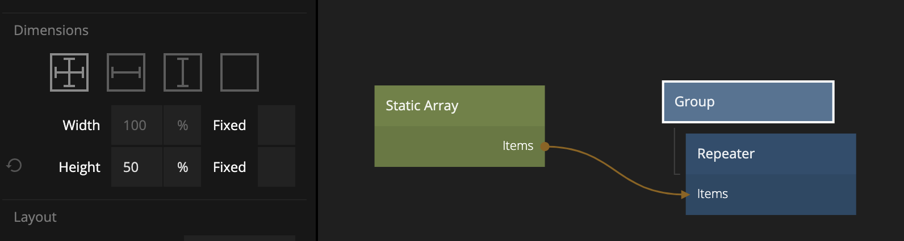

</div>

You might expect that only half the screen would be covered by the list, but you will see no change. That's because the default behavior of a **Group** with explicit size set is that _if the size of the children are larger than the size of the Group, the size will grow to fit the children_.

You can change that behavior and tell the **Group** to clip the content instead of growing. Check the **Clip Content** property of the group.

<div class="ndl-image-with-background l">

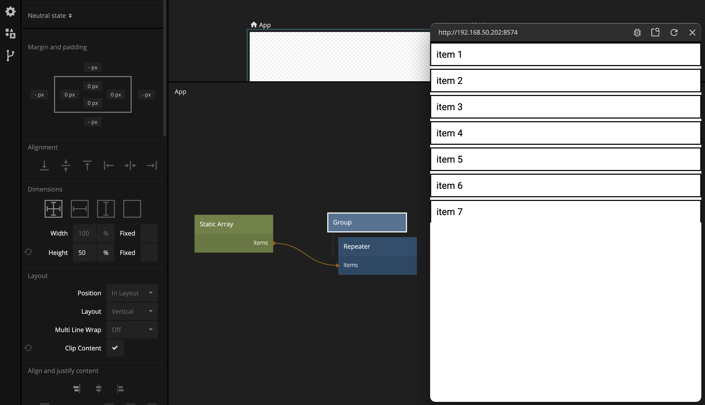

</div>

### Getting the Group to Scroll

Another way to do it is to tell the **Group** that it allows scrolling. Uncheck the **Clip Content** and instead check **Enable Scroll**. You will now have a scrollable list.

<div class="ndl-image-with-background l">

[filename](./scroll1.mp4 ':include width=100% height=300px autoplay muted loop')

</div>

As you can see there is an extra option **Use native scroll**. Generally you should have this checked, unless you are doing a very custom scroll interaction. We will not cover that in this guide.

### Structuring Scrolling Content

Change back the size to `100%` on the **Group** node.

Now let's add a title and and a footer. We can't add it to our **Group** node, because then they will scroll away with the list. So we have to restructure our layout a little.

Create a new **Group** node. Make the existing **Group** node a child of the new **Group** node.

<div class="ndl-image-with-background l">

[filename](./regroup.mp4 ':include width=100% height=400px autoplay muted loop')

</div>

Now we can add a header and a footer to the highest level **Group** and they will not be affected by the scrolling.
The header and footer could for example be a **Group** node with content height and 100% width. Then add a **Text** with a larger font. Perhaps add a bit of padding in the **Group** containing the text.

<div class="ndl-image-with-background l">

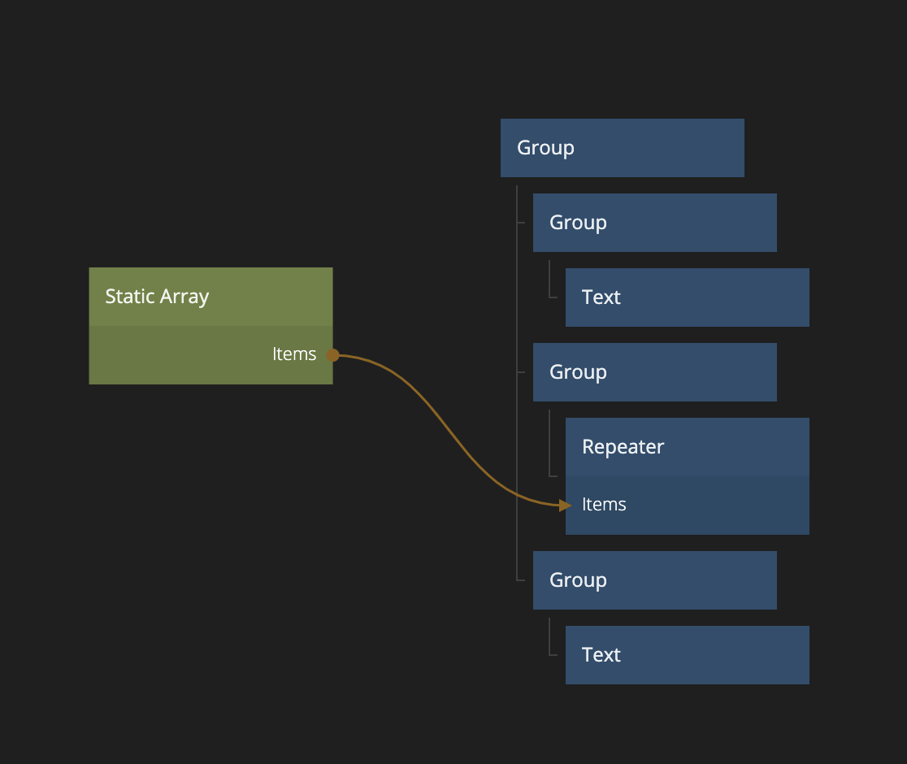

</div>

Now you can see that the footer and header are allowed to take its space while the scrolling content takes whatever is left and lets its content scroll if it doesn't fit.

<div class="ndl-image-with-background l">

[filename](./hf-scroll.mp4 ':include width=100% height=300px autoplay muted loop')

</div>

## Scrolling in Page Routers

The **Page Router** is one of the main nodes to implement navigation in Noodl. In short, the **Page Router** contains the [Pages](/nodes/navigation/page/) you navigate to. In that sense, the **Page Router** is quite similar to a **Group** node. That's why a **Page Router** also have the options to make it's content scrollable by chosing **Clip Behavior** and setting **Scrolling**.

<div class="ndl-image-with-background m">

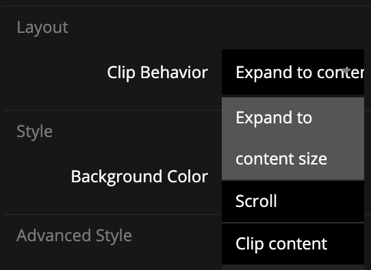

</div>

Lets try it out!

Create a new visual component. Call it "App 2". Select "Make Home" to make it the new home component (i.e it will be shown in the viewer).

<div class="ndl-image-with-background m">

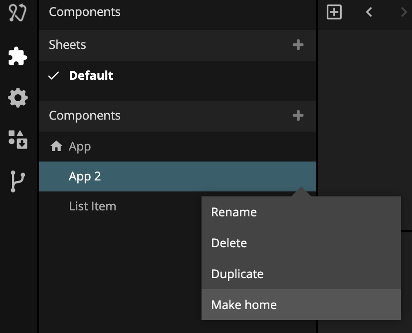

</div>

Add a **Page Router** as the first child of the root **Group**

<div class="ndl-image-with-background m">

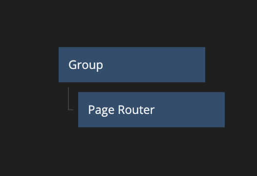

</div>

Click on the **Page Router** and click `Add new Page` and add a new **Page** called `Page 1`.

We can now simplify the previous structure. Since the **Page Router** will work as the **Group** we can move the **Repeater** (and the **Static Array** that provides the items) to right under the **Page** node in our newly created **Page** component.

<div class="ndl-image-with-background m">

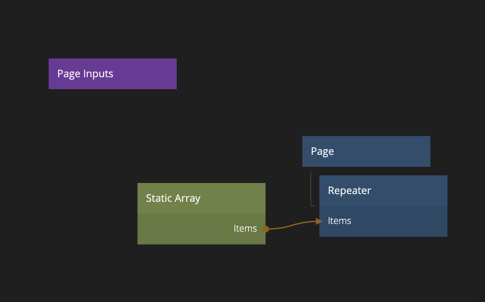

</div>

Make sure to set the **Clip Behavior** to **Scrolling** on the **Page Router** and you now have scrolling content in your **Page**. Try it out.

### Sticky Layout Position option

There is another way to get things like headers and footers to not be scrolled out of the **Group** node even if scrolling is enabled, and we will try it out on our **Page**. Instead of creating a new structure we can add our header and footer to be direct children to the **Page** node. So copy and paste them so they end up before and after our **Repeater**.

<div class="ndl-image-with-background m">

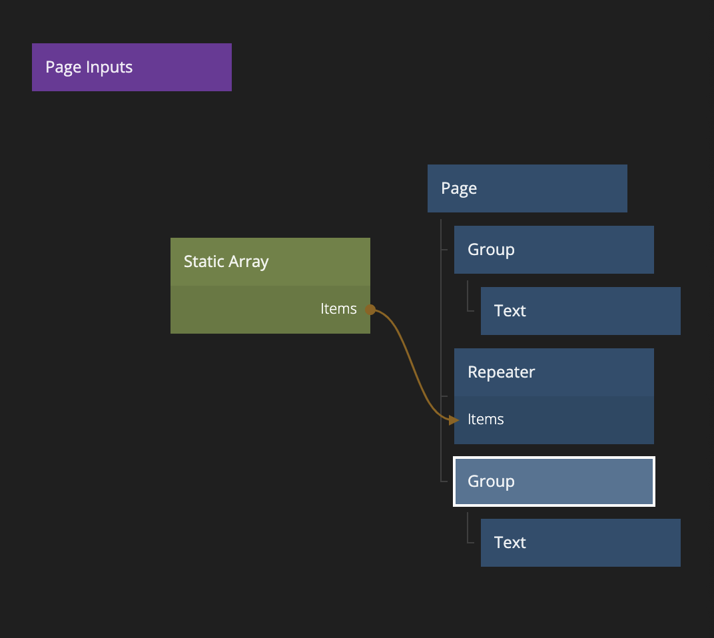

</div>

Also make sure the header is aligned to the top and the footer aligned to the bottom.

If you try scrolling now, they will be scrolled in and out of the screen. However if you change the **Position** setting for the header and footer **Group** to `Sticky` you will see that they will stay on screen.

<div class="ndl-image-with-background m">

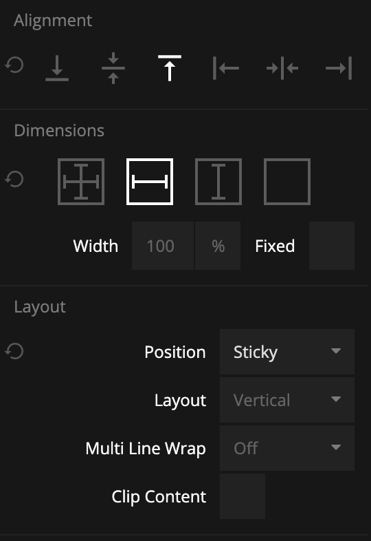

</div>

The only issue is that you can see the list scroll behind the header and footer. This is probably not what you want.

<div class="ndl-image-with-background l">

[filename](./sticky1.mp4 ':include width=100% height=300px autoplay muted loop')

</div>

You fix that by setting the background color to non-transparent white. Also since Noodl by default renders everything in the order as it's in the tree (nodes later in the tree will be rendered on top of nodes earlier in the tree if they overlap), we also need to change the **zIndex** of the header to `1` to stay on top of the **Repeater** that's below it in the tree.

<div class="ndl-image-with-background m">

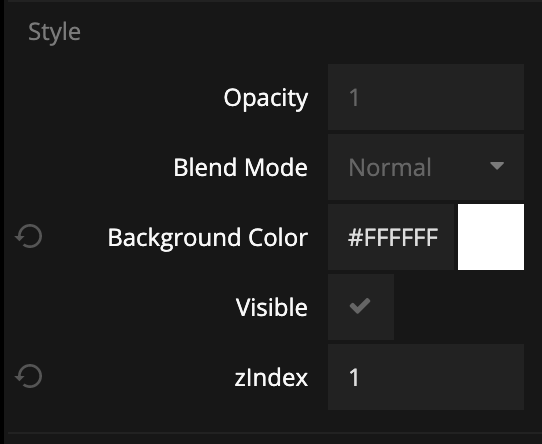

</div>

You now have a working scrolling list with a sticky header and footer.

<div class="ndl-image-with-background l">

[filename](./sticky1.mp4 ':include width=100% height=300px autoplay muted loop')

</div>

If you want to try out the full project, import the project below.

<div class="ndl-image-with-background m">
    </img>
<button class="ndl-import-button" onClick='importIntoNoodl("guides/layouts/scrolling/step-2.zip",{name:"Scrolling Part 2",thumb:"guides/layouts/scrolling/result-2.png"})'></button>
</div>


