# List Basics

## What you will learn in this guide
This guide will teach you how to create basic lists in Noodl using the [Repeater](/nodes/ui-elements/repeater/) node that is being fed through an [Array](/nodes/data/array/array/). It will show how to create a simple list item and how to detect that the user clicks it.

## Overview
The guide will walk you through the following steps.

* The **Repeater** node
* Creating a simple **List Item** component
* Connecting the data to the **List Item**
* Detecting when the user clicks an item

## The Repeater Node
The main node for making lists is the **Repeater** node. The **Repeater** node takes an **Array** as an input (the **Items** property). It then and creates a copy of the provided **List Item** template as a component and connects the specific **Object** (or **Record**) in the **Array** with its respective **List Item**.

The **Array** could for example be coming from an [Array](/nodes/data/array/array/) node, from a database through a [Query Records](/nodes/data/cloud-data/query-records/) or a [Static Array](/nodes/data/array/static-array/).

Let's get started by starting a new project using the "Hello World" template. Remove the **Text** node and add in a **Repeater** node instead.

<div class="ndl-image-with-background">

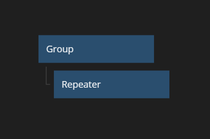

</div>

The **Repeater** needs two things to work:
1. Some **Array** data that can be represented as _List Items_
2. A _Template component_ that will be repeated per item in the **Array**

We will start with the **Array**. In this case we will use the **Static Array** might as well be some other node that outputs an **Array** for example a [Query Records](/nodes/data/cloud-data/query-records/) node that queries records from a database. There is a specific guide for working with **Query Records** [here](/guides/working-with-data/cloud-data/query-records/).

## Providing Items

So create a **Static Array** node. Change its type to ``JSON`` and paste in the following data.

```json
[
    {"name":"Peter Reid", "age":29, "team":"Everton", "position":"Midfield"},
    {"name":"Chris Waddle", "age":25, "team":"Tottenham", "position":"Midfield"},
    {"name":"Mark Hateley", "age":24, "team":"Milan", "position":"Forward"},
    {"name":"Peter Beardsley", "age":25, "team":"Newcastle", "position":"Forward"},
    {"name":"Kenneth Sansom", "age":27, "team":"Arsenal", "position":"Defender"}
]
```

<div class="ndl-image-with-background l">


</div>

Connect the **Items** output of the **Static Array** to the **Items** input of the **Repeater** node.

<div class="ndl-image-with-background l">


</div>

Now we have items flowing into the repeater.

## Create a List Item Template
Next step is to create a component that can serve as a template for the **Repeater**. One component will be created per item in the **Array** that's feeding the **Repeater**.

Create a new Visual Component. Call it "Player Item".

<div class="ndl-image-with-background">

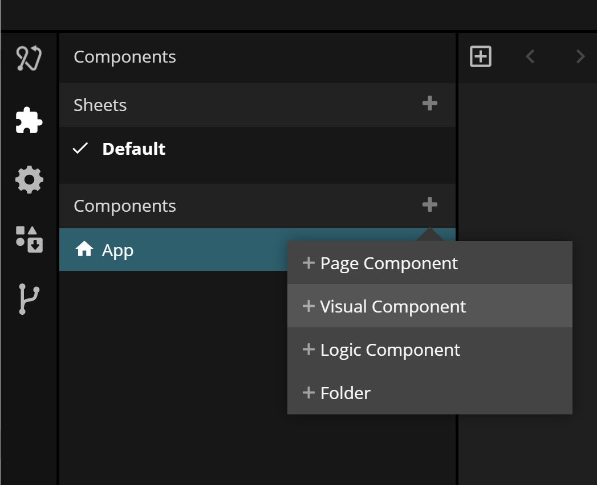

</div>

<div class="ndl-image-with-background">

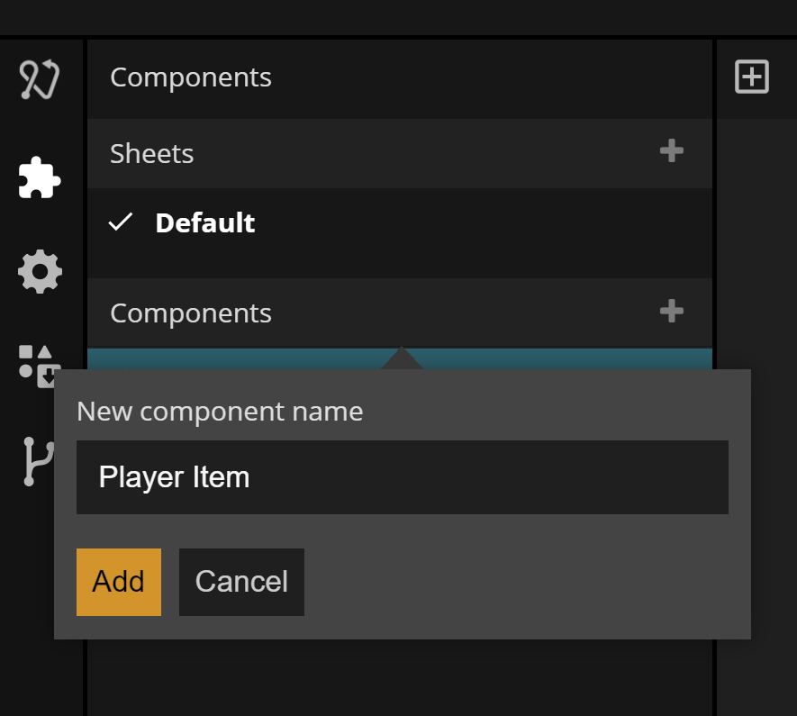

</div>

In the new component we will add in three [Text](/nodes/ui-elements/text/) nodes that will present the information about each player. Make sure to change the layout of the root node to ``Horizontal`` and add in the three **Text** nodes. Call the **Text** nodes, ``name``, ``age``, ``team`` so we can keep track of them. Note that you can use the Canvas view to get a first view of how your list item will look, even before using it in your **Repeater**.

<div class="ndl-image-with-background">

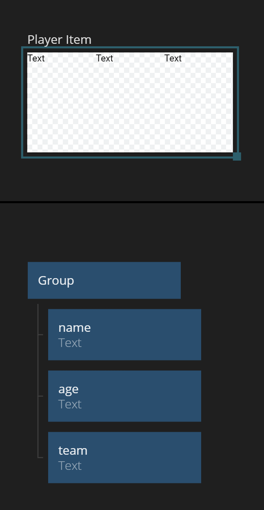

</div>

## Set the List Item Template
Go back to the main component. We now need select our newly created component as our template. Click the **Repeater** and set the template to "Player Item".

<div class="ndl-image-with-background">


</div>

You should now see the first view of you data and list item, namely something like the screen below.

<div class="ndl-image-with-background">

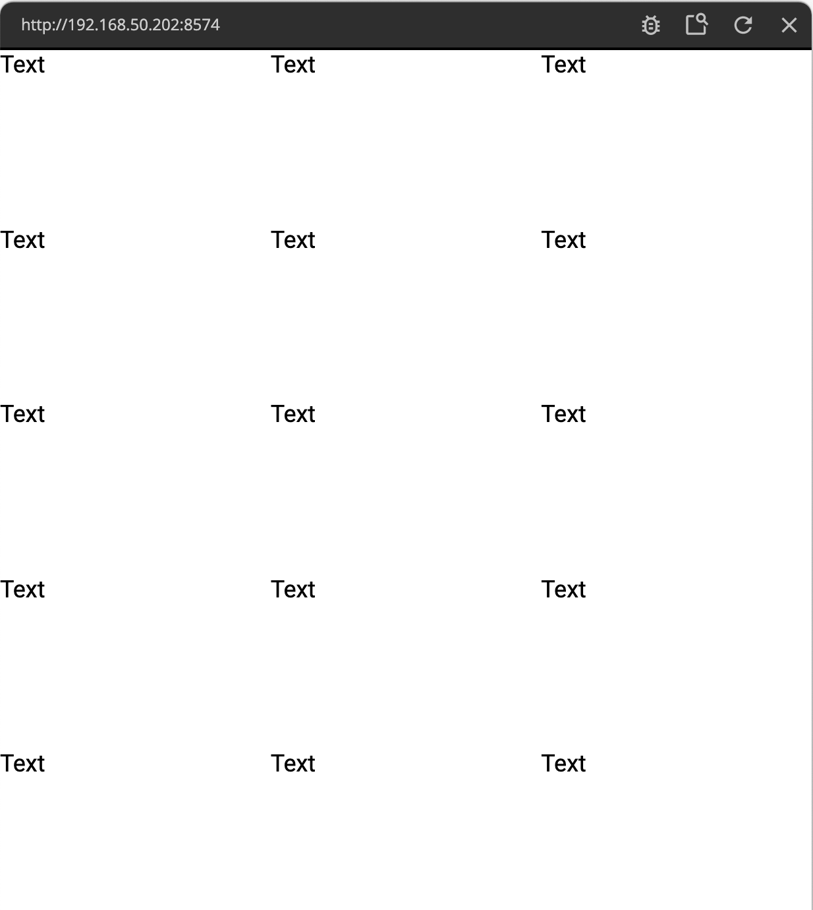

</div>

The repeater have created an instance of the "Player Item" component for each item in the incoming array. But we immediately see two things to fix:

1. The layout is weird. The **Repeater** takes up the full screen. It then divides the space equally among each list item. We should probably fix the layouting of our listitem a bit.
2. There is no data coming in from the list item. Our **Text** nodes are not connected to anything.

## Fixing the layout of the List Item
We deal with the layout first. In the "Player Item" component, click on the root **Group** and change the sizing to "Explicit width & content height". This will make the vertical size of the list item be as large as the **Texts** they contain, while still taking upp all horizontal space.

<div class="ndl-image-with-background">


</div>

Lets also add a border around each item and some rounded corners. Change "Border Style" and "Border Radius" to your liking. Finally add in some padding in all four direction (to give some air within the list item) and a margin below the list item to get some air between items.

<div class="ndl-image-with-background">


</div>

<div class="ndl-image-with-background">

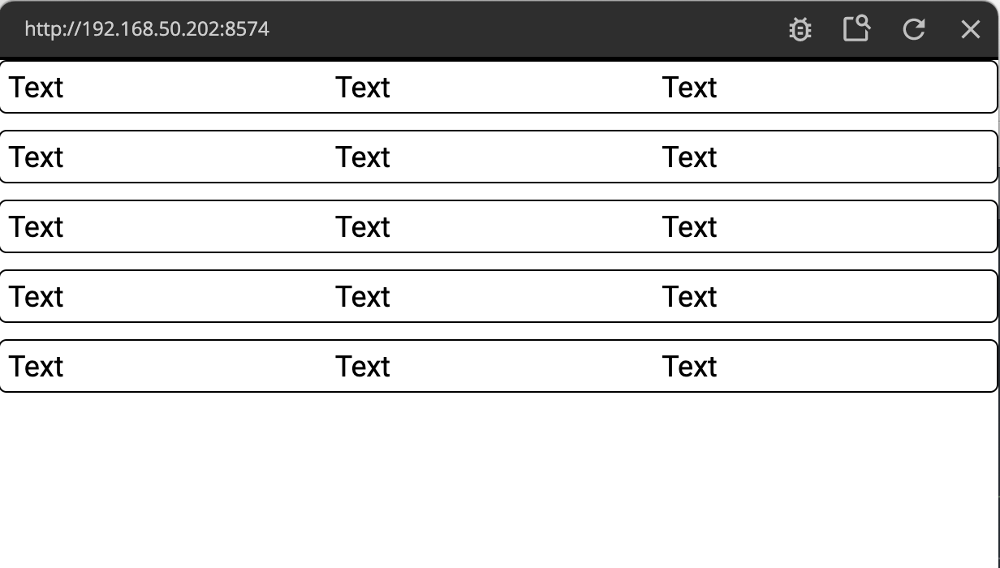

</div>

This looks better even if much more can be done. It will have to do for now.

## Connecting List Items to Data
Now we want to get the data from each item into the List Item. In the "Player Item" component, add in an [Object](/nodes/data/object/object/) node. The **Object** node is one of the central data holding nodes in Noodl. Read more about them in a dedicated guide [here](/guides/working-with-data/local-data/using-objects/).

Click the **Object** and set the **"Get Id From"** property to ``From Repeater``.

<div class="ndl-image-with-background">


</div>

You have now told the **Object** that the **Repeater** will assign its **Id**, meaning each list item will have its **Object** node point to the respective **Object** in the **Array** that feeds the repeater.

If you hover over your newly created **Object** you will actually see that it contains the data of our last item in the **Array**.

<div class="ndl-image-with-background">

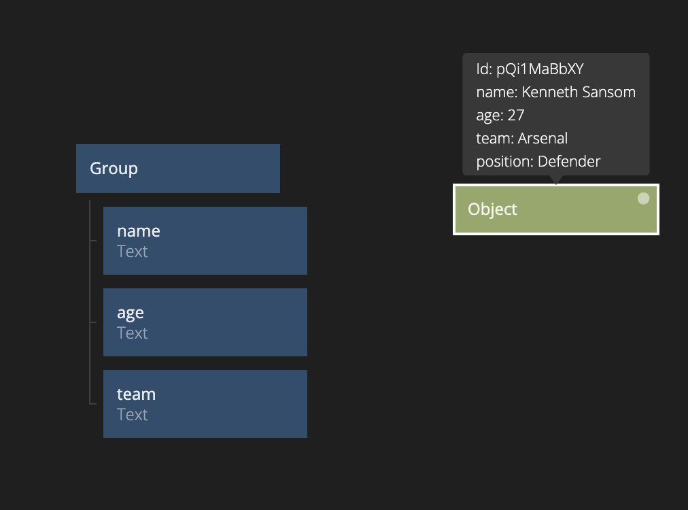

</div>

?> Note that since there are several instances of the same List Item in memory at the same time you have to be a bit careful when reading the debug output in the node graph. Generally _the last value_ in a connection or component is going to be shown as debug data. In our case, the last list item data ("Kenneth Sansom") is shown even though all the other **Objects** in the **Array** is in memory as well.

Now we are ready to hook up the **Text** nodes to our data. Create three properties on the **Object** matching the ones we have in the static array, namely ``name``, ``age`` and ``team``.

<div class="ndl-image-with-background">


</div>

Connect the **Object** properties to the **Text** input on the respective **Text** nodes.

<div class="ndl-image-with-background l">

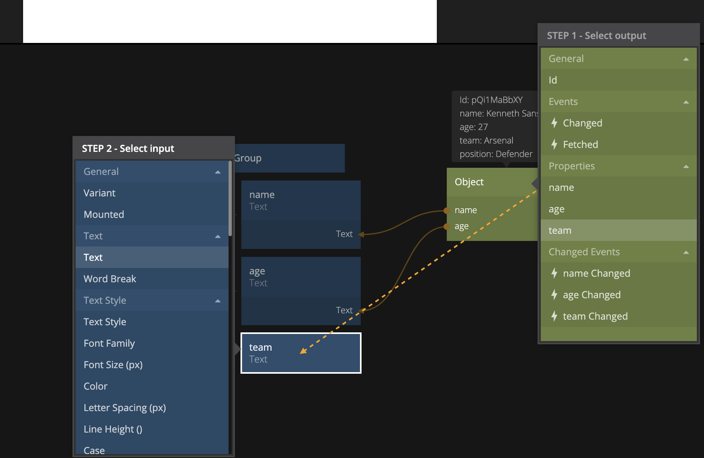

</div>

While you are connecting the data to the **Text** nodes you should see the **List Items** being populated.

<div class="ndl-image-with-background l">

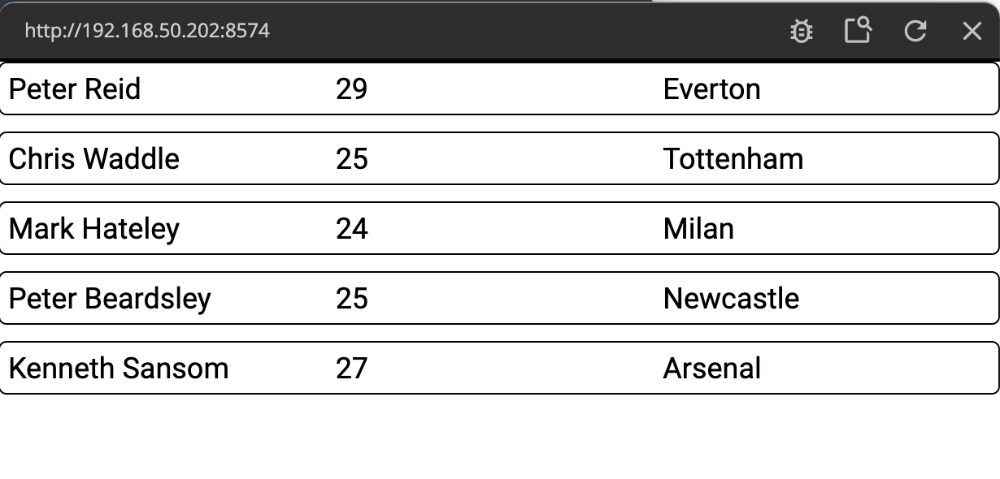

</div>

## Detecting which List Item that was clicked
Finally, we also want to know when the user clicks an item and of course which item it was. Of course we could handle all business logic related to a **List Item** within it, but it's often better to let the **List Items** be pretty simple and handle any complex logic outside the **Repeater**. In short, we want the **Repeater** to be able to report when an item was clicked and which item was clicked.

You do this by letting the List Item component having [Component Outputs](/nodes/component-utilities/component-outputs/) that are signals. You can have any number of signals coming out of your **List Item**. For example you may have a complex structure with buttons for changing and removing List Items and you want to know which one the user clicked. However in our simple case we only want to know if the **List Item** was clicked.

Go into the "Player Item" component. Add a **Component Outputs** node. In it, add a property "Click". Then connect the "Click" signal from the root **Group** to the newly created "Click" property on the **Component Outputs**.

<div class="ndl-image-with-background l">

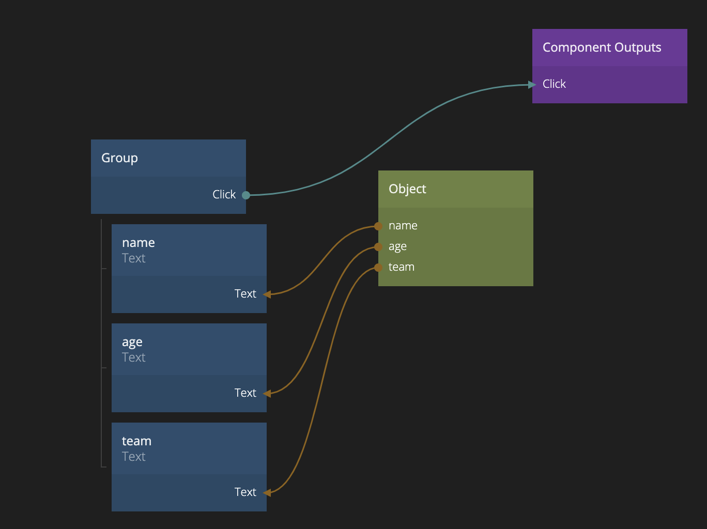

</div>

Now we are letting the **Repeater** know whenever a **List Item** is clicked.

Go back to the main app. We want to capture the outgoing **Click** signal together with the **Id** of the **Object** associated with the **List Item** that was clicked.

So create an **Object** node and connect the **Item Id** output that is now available on the **Repeater** to its **Id**.

<div class="ndl-image-with-background l">


</div>

This **Object** now will now point to the clicked item. To show that we can add a new **Text** node below the **Repeater**. Align it to the bottom and center and make sure its size is decided by its content, i.e. the **Text** node will only take up as much space as it needs, and it will end up in the center. Also make it larger, e.g. font size 24.

<div class="ndl-image-with-background">


</div>


<div class="ndl-image-with-background l">

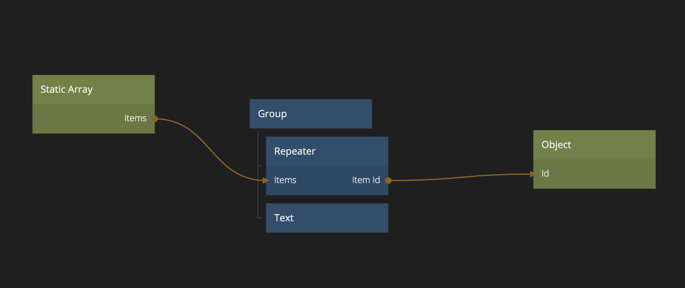

</div>

Add the property **name** on the **Object** and connect it to the **Text** node.

We are almost done, we actually need to capture the **Click** event from the **Repeater** for the **Item Id** to update when the user clicks. We anyway only want to show the text for a short while when the user clicks. 

To achieve this we add in a [Switch](/nodes/logic/switch/) node. This will keep the state weather the **Text** is shown or not so call it "Selected Text Visible". Connect the **Current State** to the **Mounted** attribute of the **Text**. Then add a **Delay** node. Set the duration to 2000 milli seconds (2 seconds).
Let the **Clicked** signal coming from the **Repeater** start the **Delay** by connecting it to **Restart**. As soon as the **Delay** is started we want to show the **Text** so connect **Started** to **On** on the **Switch** and the **Finished** signal to **Off**.

<div class="ndl-image-with-background l">


</div>

If everything works as expected you will now see the name of the player you click show up for two seconds at the bottom of the screen.
To import the project from the guide click "Import" on the image below. (Also check out the [Import Guide](/guides/importing/) for more info on importing projects).

<div class="ndl-image-with-background">
    </img>
<button class="ndl-import-button" onClick='importIntoNoodl("guides/lists/list-basics/list-part-1.zip",{name:"List Basics",thumb:"uides/lists/list-basics/final-1.png"})'></button>
</div>


