# Access Control

## What you will learn in this guide
By now you should have a good understanding of how to create, update and query records in the database. If you feel the need to freshen up your skills, check out there guides.

* [Creating a Backend](/guides/working-with-data/cloud-data/creating-backend/)
* [Creating a Class](/guides/working-with-data/cloud-data/creating-class/)
* [Creating Records](/guides/working-with-data/cloud-data/creating-records/)
* [Record Relations](/guides/working-with-data/cloud-data/relations/)

By default all records you create are completely public, so they can be read and written by any user, logged in or anonymous. This is ok while you are developing your application but as soon as it is getting ready to be released outside of your team you will need to think about access control. That is who should be able to read and write which records. Fortunately there is a pretty solid way of achieving this in Noodl.

In this guide you will learn how to limit access control to records you create to certain users.

## Access Control Rules
You can set the access conrol of a record when it is created with the **Create New Record** node or, you can update it later usign the **Set Record Properties** node. This is done using the access control rules part in the property panel. Here is an example below.

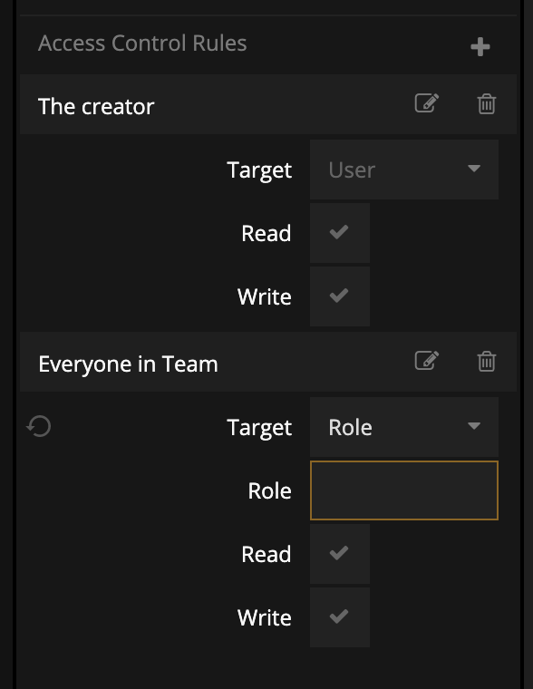

But when you place a new **Create New Record** node and view the properties the rules will be empty. You can create a new rule by clicking the **(+)** icon.

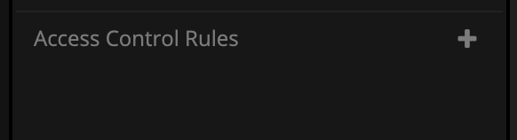

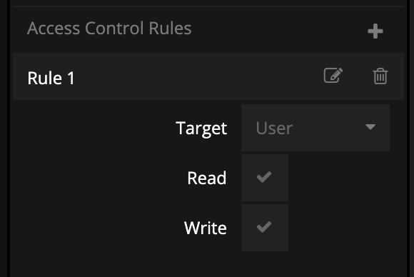

You can have how every many access control rules you want and each rule has a specific **Target** that you need to pick:

- **User** (default) this indicates that this rule will target a specific user. You can provide the user by connection to the **User Id** input for the rule (this is only available if you have choosen the **User** target). Or if you don't explicitly provide a user id the current logged in user will be used.
- **Everyone** this implies that the rule will target all users, logged in or anonymous. This can be used to create public but read only records.
- **Role** this target should be used if you want this record to be accessible by a group of users. We will take a closer look at roles below.

First let's take a look at a common rule where we make sure the user creating the record has access rights to reading and writing the record.

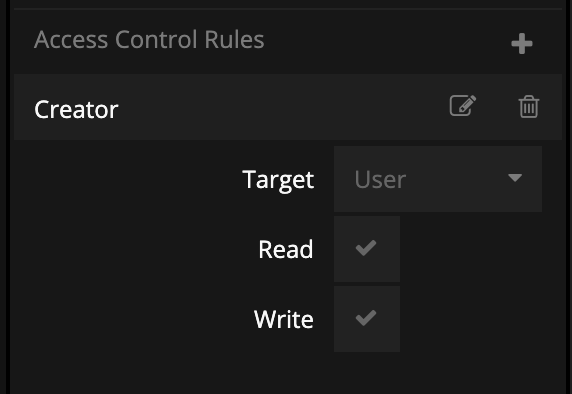

This is simply the default settings for the rule. It is recommended that you edit the label of the rule and give it a short descriptive name so that you know later what it is supposed to achieve. Ok so if we use this rule to create records only the current user will be able to access them. This requires that a user has been [logged in](/nodes/data/user/log-in/).

Now let's say that we also want everyone to be able to read the records but not change them. Then we would add a rule with the **Everyone** target.

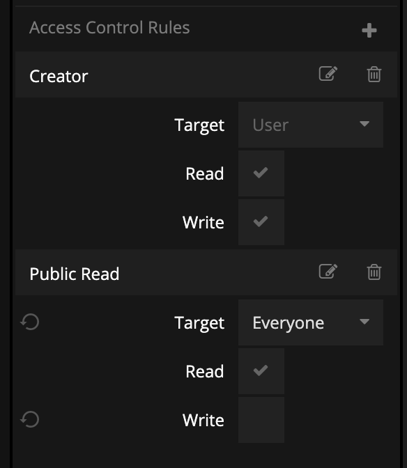

There are many ways you can use this pattern to control who can access your record. Let's say you are creating a **Message** record and you want the current users (the sender) to be able to read and write the message, and the receiver to be able to read it. You would use a very similar set of rules but with two **User** targets.

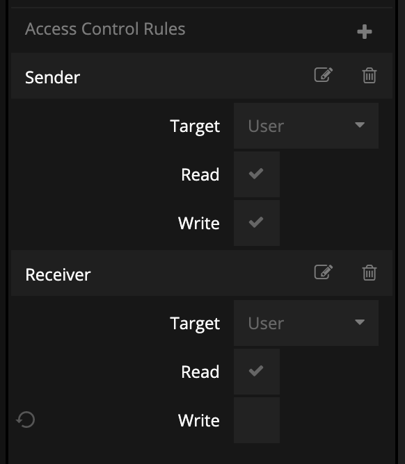

But you will also need to provide the **User Id** of the receiver (the sender will user the current logged in user). This is done via a connection to the **User Id** input that is created when you add a new **User** target rule.

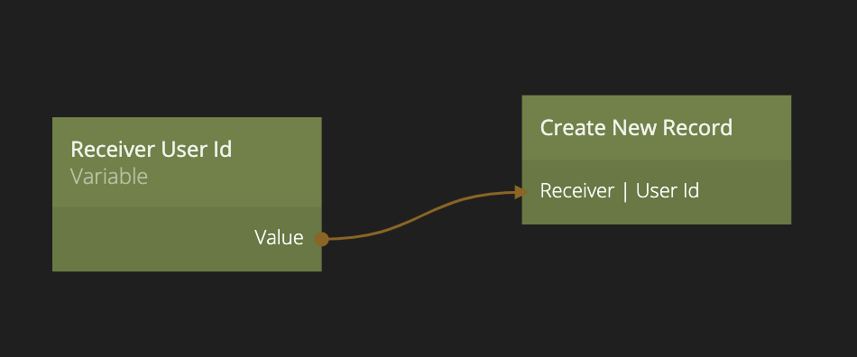

## Roles
This is great, but sometimes you want to have a record accessible by many users and if these users change over time it's a hazzle to update all records accordingly. This is where roles come in. A role is in it's essence simply a list of users (this is esstablished via a relation property called **users** on the role). You can add and remove users from the role using the **Add Record Relation** and **Remove Record Relation** nodes. You can add a role via the cloud services dashboard.

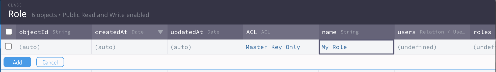

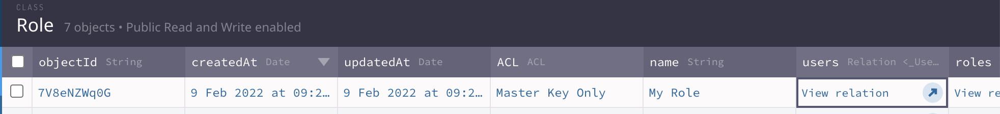

You need to provide a **Name** for your role (this needs to be unique among all roles), you also need to specify the **ACL** (the access control) and you should generally limit it to **Master Key Only** for roles that you create in the dashboard. Once the role is created you can add users to it via the **User** relation directly in the dashboard.

Once you have a role in place with users assiged to it you can simply create a **Role** access rule:

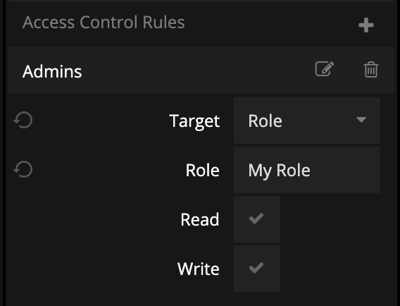

You choose the **Role** target, give it a descriptive label and choose the access rights. Then you need to specify the **Role Name**, that is the unique name you gave the role when creating it. This is case sensitive.

Most cases you want to create and manage your roles dynamically, for instance if you want to create a team of users that should have access to certain records. Then you would create a role for that team and add relations to all team members. 

This is achieved by creating a new role, which is done as any other record with the **Create New Record** node, picking the **Role** class. You need to limit the access control of the **Role** otherwise it will not succeed to create. Here we let the creater, i.e. the current user have full access and also we grant access to "everyone in the team". This is done via the role name, that is the same name as we give the role when creating it (we provide that via a connection as shown below).

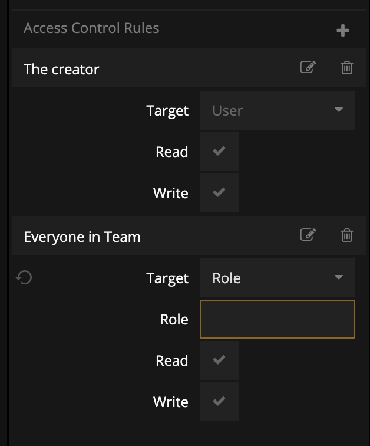

You need to provide a unique **name** for your new role, in the example below this is simply done with the **Unique Id** node. This is provided both to the **name** input for the role and also to the **Everyoone in Team** access rule as described above.

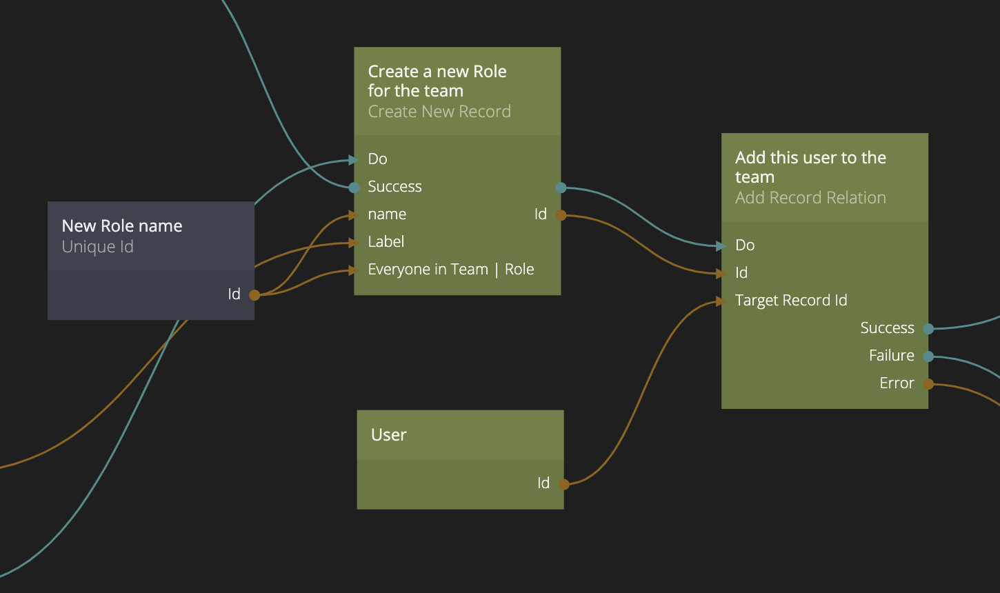

Once the new **Role** is created we add the current logged in user to the role by adding a relation usign the **Add Record Relation** node. The current user already has read and write access to the role via **The creator** rule above, but we still add the user to the role as it should be listed as a team member. This is how we set up the **Add Record Relation** node.

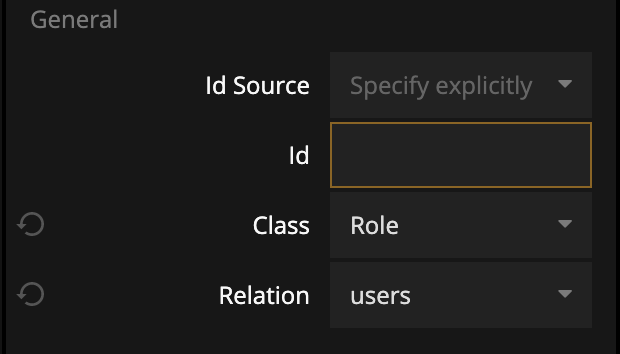

The **Id** is coming from the newly created role (that is the record where we want to add a relation), the class needs to be set to **Role** and the relation we want to add to is **users**. 

Finally the **Target Record Id** is the user we want to add to the role and as you an see in the node graph above we get the from the **User** node that contains information on the currently logged in user.

