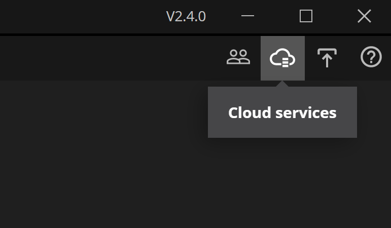
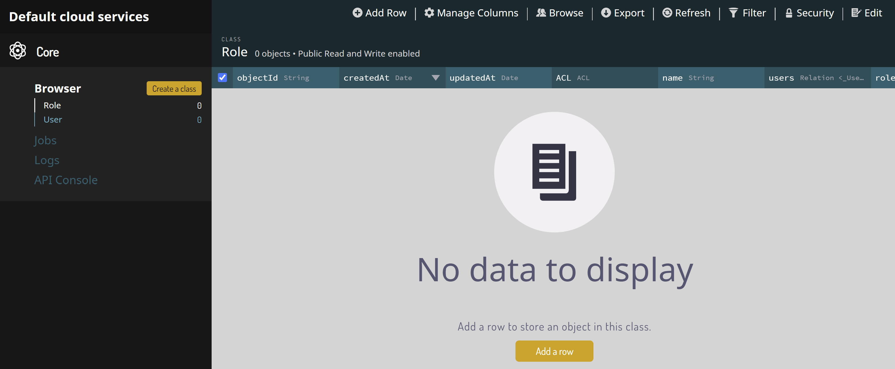

# Creating a Backend for your project

## What you will learn in this guide
This guide will take you through the process of creating a **Backend** for your Noodl project. A **Backend** is needed if you want to fetch and store data for you application in a **Database**.

## Overview

We will go through the following steps in this guide:
* Creating a Backend
* Selecting a Backend for you project
* Inspect the **Backend Database** using the **Dashboard**
* Create and switch to a new **Backend**

## What is a Backend and when do you need it?
A **Backend** is a piece of software running in the cloud that helps serving your Noodl app with data and cloud functionality. The main reason for using a **Backend** in your project is to use its **Database**. For example the nodes [Record](/nodes/data/cloud-data/record/) and [Query Records](/nodes/data/cloud-data/query-records/) can only be used if you have a **Backend** active for you project.

Each **Backend** has a dedicated database which means you might want to have multiple **Backends** available for your project, for example one for your test data and one for your production data. Only one **Backend** can be enabled at a time.

Also note that **Backends** are shared within a workspace, i.e. all projects in a workspace have access to the same **Backends**.

### Internal vs External Backends
In Noodl there are two types of **Backends**, __Internal__ and __External__. The **Internal Backends** are easiest to use, since Noodl can create those for you in a few clicks. **External Backends** are Backends that you set up and host yourself. In this guide we will focus on **Internal Backends**.

To add a new Cloud Service click the **Cloud Services** icon in the top right.

Go to the **Add Cloud Service** tab.

Give the Cloud Service a name, for example "My Cloud Service" and a description "My cloud service for development". It could be a good idea to have multiple cloud services for the same project, since each cloud service will have its own database. This means that you can have one cloud service for development - where it doesnt matter if you mess up your data - and one for production.

You can skip filling in a Master Key, which means that Noodl will automatically generate one for you.

## Select active backend
Now you can select the newly created Backend as the Backend for your project.

This means that any data requests, for example from a [Query Records](/nodes/data/cloud-data/query-records/), will come from this backend.

## Inspect the Backend using the Dashboard
Now your project is connected to a **Backend** with a **Database**. The best way to get an overview of the database is to open the **Dashboard**. You open it by clicking the `Open dashboard` button on your Cloud Service.

No you can see the contents of your **Database** in the menu to the left, under `Browser`. Right now, the Database contains two _classes_: `User` and `Role`. These two classes are created automatically. These classes are used to manage login and credentials in your app but we will not care about them in this guide.

### Classes
A **Class** in the database is a collection of **Records** of the same type. In other databases these are often referred to as __Tables__ or __Collections__. In the case of the `User` class, it contains **User Records** where each record have data properties such as User Name, Email, etc. A typical app will have many different classes but we will not create any new classes in this guide. Instead you can close the **Dashboard** window for now.

## Creating and switching to a new backend
Now you can create a second backend, by clicking `Create New Backend`. Give it a name, for example `Second Backend` and a short description: `My production backend`. You now have a second backend in the list, that you can switch to by clicking `Set as Project Backend`.

If you now open the **Dashboard** again, but for the second backend, you can see that the **Dashboard** is now showing the contents of the Database in "My second backend". The content looks the same as the **Default Backend**, containing the `User` and `Role` classes with no entries yet. But they are located in a different database.

