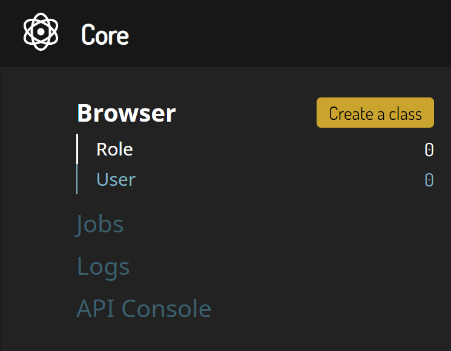
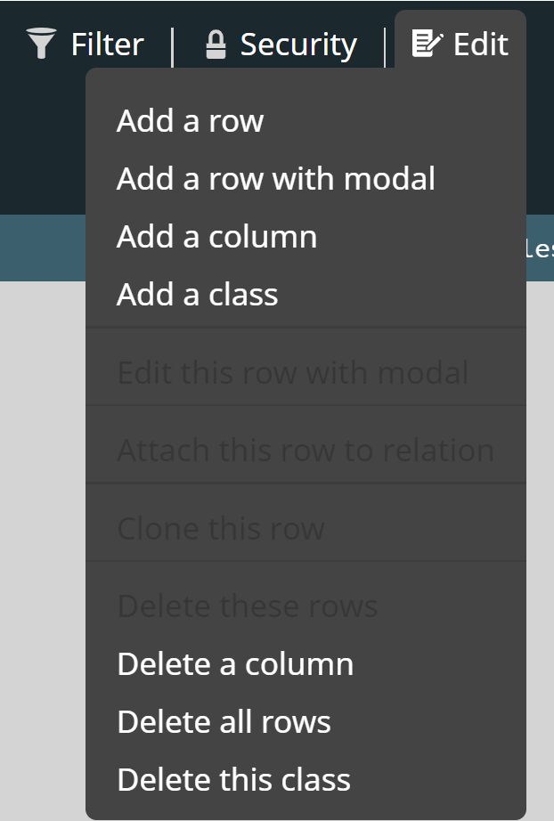
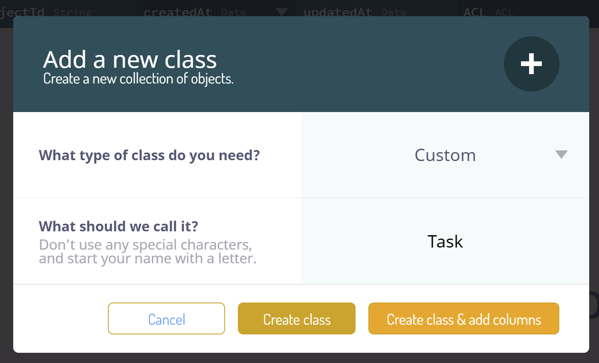
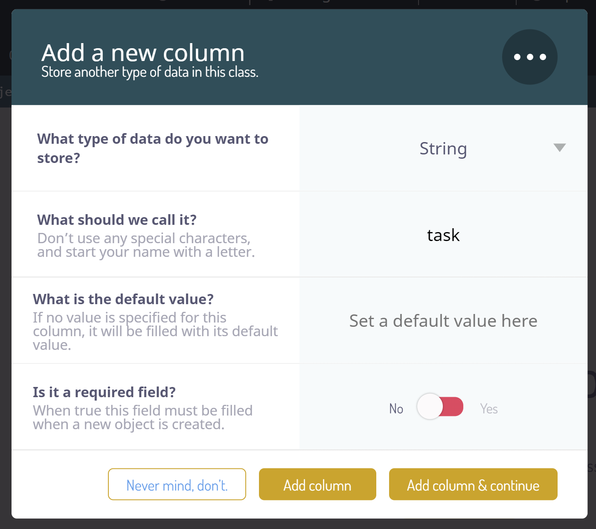
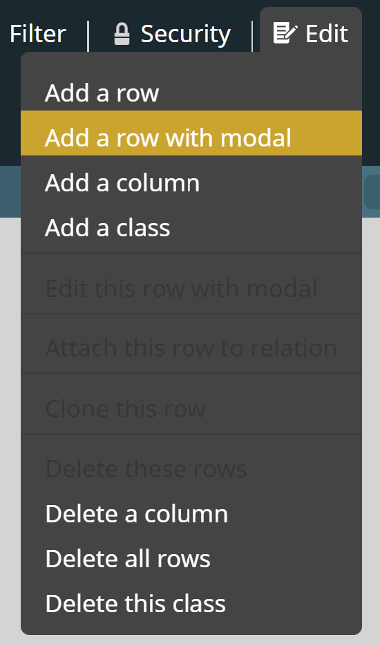

# Creating a Class in the Database

## What you will learn in this guide
In this guide you will learn how to create new **Classes** in the database and add new **Columns** to it. **Classes** are used to hold **Records** in a Database in Noodl.

## Overview
We will go through the following steps in this guide
- Add a new **Class** to the Database using the **Dashboard**
- Add new **Columns** to the Class
- Add a couple of new **Records** in the Class through the **Dashboard**

Before you start this guide, make sure you have enabled Cloud Services and have a Backend active for your project. You can learn how to do this in [this](/guides/working-with-data/cloud-data/creating-backend/) guide.

## Add a new Class to the database using the **Dashboard**
First, make sure you have an active Backend for your project. Then click the `Dashboard` button in the Cloud Services menu.

Now you can add a new Class to the database either by clicking the yellow button `Create a Class` in the menu to the left, or open the `Edit` menu and select `Add a Class`.

Next step is to give the **Class** a name. Fill in a name, for example `Task` and make sure it's of the type `Custom`. Now you can select `Create class and add columns`.

## Adding Columns to a Class

### What is a column?
Each **Class** in Noodl have a number of Columns which defines what type of data each **Record** in the class can have. For example, if you are building a Task Management app, you may have a class called `Task`, with the columns `task` and `isDone` as two columns, holding the description of the task and wether the task is done or not. In Noodl, the **Columns** will be represented as properties on the [Record](/nodes/data/cloud-data/record/) node that can be used as inputs our outputs.

### Column Types
Each **Column** has a specific data type that decides what kind of data it can hold.
There are 11 different data types available:
* **String** - a string value
* **Boolean** - a boolean value (can be `true` or `false`)
* **Number** - a number value
* **Date** - a date (stored in iso format)
* **Object** - a JavaScript object
* **Array** - a JavasSript array
* **Geopoint** - A Geopoint, i.e. a location on the surface of the earth
* **Polygon** - a GEOJSon polygon object
* **File** - a reference to a file
* **Pointer** - A pointer to another **Record** in a **Class**
* **Relation** - A list of relations to other **Records** in a **Class**

In this guide, we will focus in on the simpler data types, `String`, `Boolean` and `Number`.

Lets add two columns to our **Class**, `task` - a `String` type column, and `isDone` - a `boolean`. You can also chose to have a default value for each column that will be set if a new **Record** has no entry set for that column. In our case, let set the default value of `isDone` to `false`.

You can also select if a **Column** is required for a new **Record** to be added in the **Class**. If set to `true`, the insertion will any new **Record** that has no value provided for the **Column**. Right now we don't want that, so we will leave it in the state `No` for both **Columns**.

### The default columns
As you can see when inspecting your new Task Class in the **Dashboard**, it also contains a few other **Columns**. These are automatically created you should generally not remove them. They are actually quite useful. The default columns are

* **objectId** - This is a unique identifyer for each **Record**. This identifyer will become the `id` property of the **Record** node when refering to it using a **Record** node.
* **createdAt** - A Date object containing the date and time for when the **Record** was created.
* **updatedAt** - A Date object containing the date and time for when the **Record** was last updated.
* **ACL** - A special column to keep track of which users and roles that has the right to fetch and store this object. For now, lets leave it as it is.

## Adding a new Record
Now it's time to add a new **Record** to the Task Class. You can add **Record** either through the `Add a row`-button or through the `Edit` menu and then selecting `Add row` or `Add row through modal`. Let's click on the latter button. This brings up a form that lets you fill out the values for each **Column** for the new **Record**.

Add a few **Records** and see them pop up in the **Class**. You can also try deleting them by selecting them and click `Edit`->`Delete these rows`.

