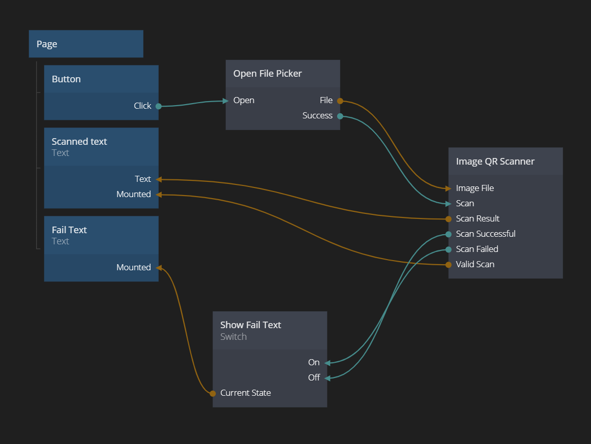

# Image QR Scanner

The **Image QR Scanner** node is used to scane an image for a QR code. It's typically used in conjunction with the [Open File Picker](/nodes/utilities/open-file-picker/) node, to allow the user to upload a file.

When a QR code has been successfully identified, the node will send a Scan Successful event and the decoded string, otherwise Scan Failed.

## Inputs

| Data                                      | Description                                                                                                                |
| ----------------------------------------- | -------------------------------------------------------------------------------------------------------------------------- |
| Image File   | The image file to look for the QR code in. Typically provided through an **Open File Picker** node. The input should be of type [File](https://developer.mozilla.org/en-US/docs/Web/API/File)   |

| Signal                                         | Description                                                                                |
| ---------------------------------------------- | ------------------------------------------------------------------------------------------ |
| Scan | Triggers a QR code scan in the file provided in the **Image File** input. |

## Outputs

| Data                                            | Description                                                                                      |
| ----------------------------------------------- | ------------------------------------------------------------------------------------------------ |
| Scan Result         | This output contains the decoded string when a QR code has been found and decoded. If no QR code is found this string will be empty.            |
| Valid Scan          | A **boolean** that is **true** if the last scan was valid, otherwise **false**.   |

| Signal                                       | Description                                                                               |
| -------------------------------------------- | ----------------------------------------------------------------------------------------- |
| Scan Successful        | Sends a signal when a successful scan was done. The resulting scan is on the **Scan Result** output. |
| Scan Failed | Sends a signal when the latest scan failed, i.e. no QR code was found. |

