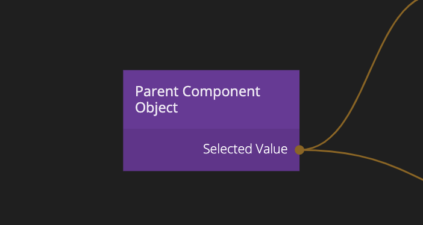

<##head##>

# Parent Component Object

**Parent Component Object** is always used in combination with a [Component Object](/nodes/component-utilities/component-object/). A **Parent Component Object** will search upwards in the component tree until it finds a **Component Object** node and mirror that node. Any change being done to one node will be reflected in the other nodes. Multiple **Parent Component Object** nodes in the same component will always mirror the same **Component Object**.

The node is used much like an [Object](/nodes/data/object/object/) where you can output properties on the node. The node does not have an **Id** instead the data is shared with the parent component. This node is very useful in patterns such as radio groups where child components may need to access the **Component Object** of its parent.
<##head##>

## Inputs

### Properties

| Data                                     | Description                                                                                                                                                                                                                               |
| ---------------------------------------- | ----------------------------------------------------------------------------------------------------------------------------------------------------------------------------------------------------------------------------------------- |
| Properties | <##input:value-\*##>The properties to set on the closest parent [Component Object](/nodes/component-utilities/component-object/). When this input is changed via a connection the parent **Component Object** will be updated.<##input##> |

| Signal                                | Description                                                                                                                                                                                                                                                                                                                                                                                            |
| ------------------------------------- | ------------------------------------------------------------------------------------------------------------------------------------------------------------------------------------------------------------------------------------------------------------------------------------------------------------------------------------------------------------------------------------------------------ |
| Fetch | <##input:fetch##>Normally when a **Parent Component State** is created, the property outputs are immediately updated. If you want to control how the data is updated you can connect to the _Fetch_ signal input. Then you need to explictly send a signal to fetch the data.<##input##>  With **Fetch** connected the output data won't change until **Fetch** is explicitly triggered again. |

## Outputs

### Properties

| Data                                            | Description                                                                                                                                           |
| ----------------------------------------------- | ----------------------------------------------------------------------------------------------------------------------------------------------------- |
| Parent Properties | <##output:value-\*##>The values of the properties of the closest parent [Component Object](/nodes/component-utilities/component-object/).<##output##> |

| Signal                                                   | Description                                                                                                                                                                                                                                                               |
| -------------------------------------------------------- | ------------------------------------------------------------------------------------------------------------------------------------------------------------------------------------------------------------------------------------------------------------------------- |
| Changed                  | <##output:changed##>This event is triggered when any of the properties have changed.<##output##>                                                                                                                                                                          |
| Fetched                  | <##output:fetched##>Signal when this node has bound itself to a [Component Object](/nodes/component-utilities/component-object/). Triggers immediately if the **Fetch** inputs isn't connected, and will otherwise trigger when the **Fetch** input is signaled.<##output##> |
| Changed Property Signals | <##output:changed-\*##>One changed signal output will be created for every property. They will emit a signal when the property changes value.<##output##>                                                                                                                 |
