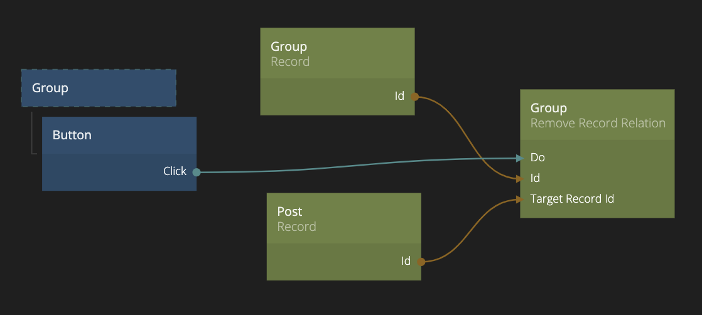

<##head##>

# Remove Record Relation

This node is used to remove a relation between two records, the owning record and the target record.

One record is the owning record (in this case **Group** records that can have a relation to many **Post** records), it should have a **Relation** type property.

You need to provide the Id of the owning record. You also need to provide the Id of the record that you want to add a relation to, this is the Target Record Id input.

Finally, send a signal to Do to perform the action.

<##head##>

## Inputs

| Data                                           | Description                                                                                                                                                                                                          |
| ---------------------------------------------- | -------------------------------------------------------------------------------------------------------------------------------------------------------------------------------------------------------------------- |
| Class            | The **Class** of the owning record where you want to remove the relation from.                                                                                                                                       |
| Id               | <##input:id##>Specify the **Id** of the record that you want to use as the owning record to remove an existing relation from.<##input##> This input is only valid if **Id Source** is set to **Specify explicitly**. |
| Relation         | You need to choose the **Relation** property of the owning class to use when removing the relation.                                                                                                                  |
| Target Record Id | <##input:target record id##>This input should be connected to the **Id** of the target record that have an existing relation to the owning record via the **Relation** property that should be removed.<##input##>   |

[filename](../id-source.md ':include')

| Signal                             | Description                                                                                                                 |
| ---------------------------------- | --------------------------------------------------------------------------------------------------------------------------- |
| Do | <##input:do##>When a signal is received on this input the relation will be removed in the backend, if it exists.<##input##> |

## Outputs

| Data                                | Description                                                                                                                         |
| ----------------------------------- | ----------------------------------------------------------------------------------------------------------------------------------- |
| Id    | <##output:id##>This is the **Id** of the owning record. It is simply a mirror of the **Id** input.<##output##>                      |
| Error | <##output:error##>The error message in case something went wrong when attempting to remove the relation in the backend.<##output##> |

| Signal                                  | Description                                                                                                                                                                                    |
| --------------------------------------- | ---------------------------------------------------------------------------------------------------------------------------------------------------------------------------------------------- |
| Success | <##output:success##>A signal is sent on this output when the relation has been removed successfully in the backend.<##output##>                                                                |
| Failure | <##output:failure##>A signal is sent on this output if something went wrong when removing the relation in the backend. The error message will be outputed on the **Error** output.<##output##> |
