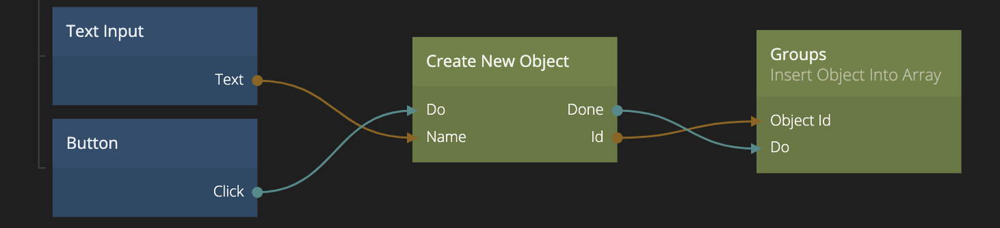

<##head##>

# Create New Object

The node can be used to create a fresh new [Object](nodes/data/object/object/).

You can provide any number of properties with values for your new Object. When the **Done** signal is sent the Object is created and you can perform other actions using the Object.

<##head##>

## Inputs

[filename](../properties.md ':include')

| Signal                             | Description                                                                                                 |
| ---------------------------------- | ----------------------------------------------------------------------------------------------------------- |
| Do | <##input:do##>Send a signal in this input to create the new Object with the provided properties.<##input##> |

## Outputs

| Data                             | Description                                                                                                                          |
| -------------------------------- | ------------------------------------------------------------------------------------------------------------------------------------ |
| Id | <##output:id##>The **Id** of the newly created object, this output is valid only when the **Done** signal has been sent.<##output##> |

| Signal                               | Description                                                                                     |
| ------------------------------------ | ----------------------------------------------------------------------------------------------- |
| Done | <##output:done##>A signal is sent on this output when the Object have been created.<##output##> |
