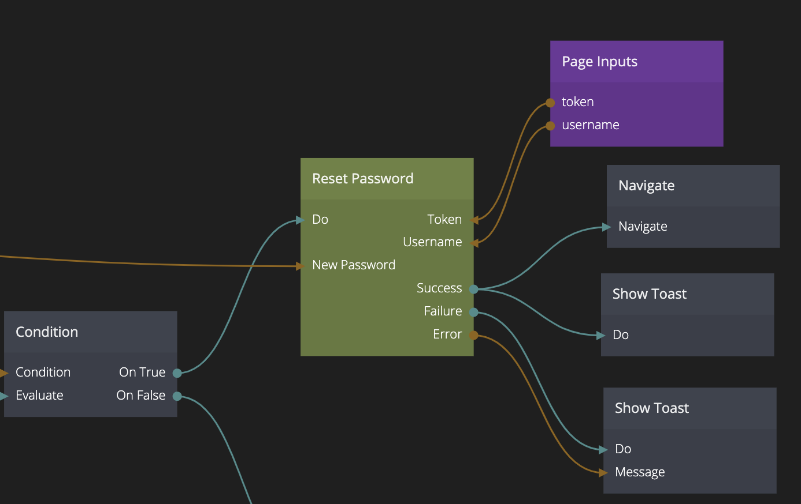

<##head##>

# Reset Password

This node is used to reset the email of a user. When this action is performed successfully the user will have it's password changed to the **New Password** provided as input to the node. This node will need three things to successfully change the password for the user, the Username and a secret Token that should be delivered to your user via the [Request Password Reset](/nodes/data/user/request-password-reset/) action node, and finally a New Password.

Generally your application should have a specific **password reset page** that is linked to from the password reset email, the username and token should be provided as query parameters to the page. This page should have the user input the new password and once it's validated your should pass it on New Password input. Once you have hooked that up you need to trigger the Do action.

<##head##>

## Inputs

| Signal                             | Description                                                                                                                  |
| ---------------------------------- | ---------------------------------------------------------------------------------------------------------------------------- |
| Do | <##input:do##>Send a signal to this action to attempt to change the password for the given username and token.<##input##> |

| Data                                | Description                                                                                     |
| ----------------------------------- | ----------------------------------------------------------------------------------------------- |
| Username | <##input:username##>The username that this action will attempt to change the password for.<##input##> |
| Token | <##input:token##>The secret token needed to change the password.<##input##> |
| New Password | <##input:token##>The new password to set for the user.<##input##> |

## Outputs

| Signal                                  | Description                                                                                                                                                                   |
| --------------------------------------- | ----------------------------------------------------------------------------------------------------------------------------------------------------------------------------- |
| Success | <##output:success##>The password was successfully changed.<##output##>                                                                                     |
| Failure | <##output:failure##>This event will be triggered if something when wrong when changing the password. The error message can be found in the **Error** output.<##output##> |

| Data                                | Description                                                                                     |
| ----------------------------------- | ----------------------------------------------------------------------------------------------- |
| Error | <##output:error##>This output will contain the error message if the action failed.<##output##> |