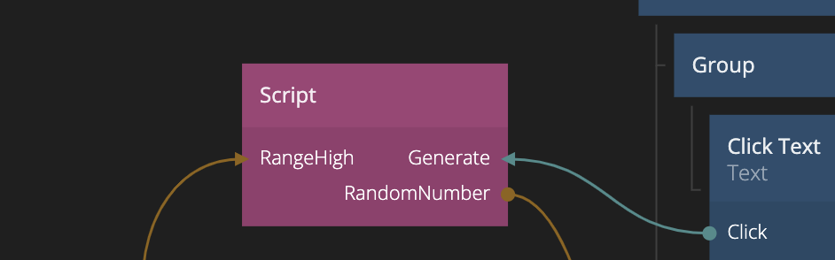

<##head##>

# Script

This node allows you to add complex JavaScript to your application. Please refer to the [Script Guide](/guides/javascript.md) to learn more about the API. But remember - with great power comes great responsibility.

<div class="ndl-image-with-background l">



</div>

In most cases you are better off using the simpler <span class="ndl-node">[Function](/nodes/javascript/function/)</span> node for your custom JavaScript.

## Getting Started
Reading the Javascript [guide](/guides/javascript.md) gives a broader understanding of how it works.

Here is an example of how you create a function that you can call in the node graph:
```javascript
Node.Signals.MyFunction = function(value) {
    // run javascript code
}
```

<##head##>

## Inputs

The inputs are defined by the content of the script or by explicitly specifying inputs in the properties. See the javascript [guide](/guides/javascript.md) for more details.

## Outputs

The outputs are defined by the content of the script or by explicitly specifying outputs in the properties. See the javascript [guide](/guides/javascript.md) for more details.
