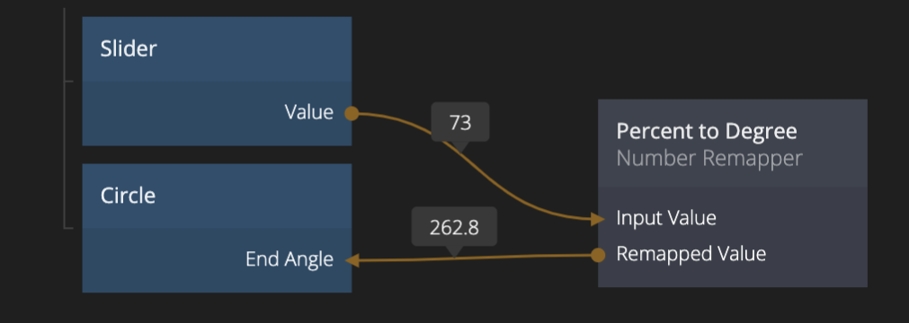

<##head##>

# Number Remapper

This node maps a range of input numbers to a range of output numbers. It translates the relative position of the input number to its corresponding number in the output range.

If the input range is `0 to 360`, the output range is `0 to 1` and the input number is `180` the output number will be `0.5`.

<##head##>

## Inputs

| Data                                         | Description                                                                                                                                                                                                                                                                                                                                                                                            |
| -------------------------------------------- | ------------------------------------------------------------------------------------------------------------------------------------------------------------------------------------------------------------------------------------------------------------------------------------------------------------------------------------------------------------------------------------------------------ |
| Input Value    | The number to remap.                                                                                                                                                                                                                                                                                                                                                                                   |
| Input Minimum  | When the _Input Value_ equals this value the output of this node will exactly equal the value specified in _Output Minimum_.                                                                                                                                                                                                                                                                           |
| Input Maximum  | When the _Input Value_ equals this value the output of this node will exactly equal the value specified in _Output Maximum_.                                                                                                                                                                                                                                                                           |
| Output Minimum | The lowest value to output.                                                                                                                                                                                                                                                                                                                                                                            |
| Output Maximum | The highest value to output.                                                                                                                                                                                                                                                                                                                                                                           |
| Clamp Output   | Controls the behavior if the _Input Value_ is lower than _Input Minimum_ or higher than _Input Maximum_.  If _Clamp Output_ is set to _Yes_ then the output will not be lower than _Output Minimum_ or higher than _Output Maximum_. If _Clamp Output_ is set to _No_ then the output will be linearly extrapolated and will be lower or higher than the specified minimum and maximum values. |

## Outputs

| Data                                         | Description                                                                |
| -------------------------------------------- | -------------------------------------------------------------------------- |
| Remapped Value | The result of remapping the _Input Value_ with the values specified above. |
