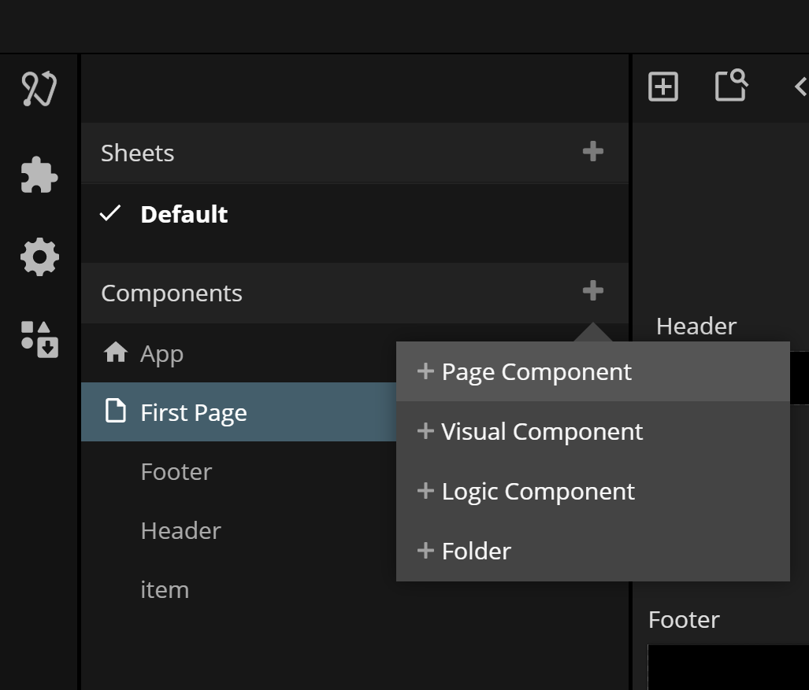

<##head##>

# Page

The **Page** node is a basic building block when creating web type navigation using a [Page Router](/nodes/navigation/page-router/). Note: **Page** nodes cannot be created throught the node picker, it can only be created by adding a new **Page** in the component list.

**Pages** are typically used together with a [Page Inputs](/nodes/navigation/page-inputs/) node to be able to provide parameters to the **Page**.

<##head##>

## Inputs

| Data                                   | Description                                                                                                                                                                                                                                                          |
| -------------------------------------- | -------------------------------------------------------------------------------------------------------------------------------------------------------------------------------------------------------------------------------------------------------------------- |
| Title    | <##input:title##>This property controls the title of the **Page** i.e. what the title of the browser window will be say when the **Page** is active.<##input##>                                                                                                      |
| URL path | <##input:urlPath##>This property controls the URL route to this **Page** in relation to its [Page Router](/nodes/navigation/page-router/).<##input##> See the documentation for [Page Router](/nodes/navigation/page-router/) for more details on how routing works. |

This node supports the following [Visual Input Properties](nodes/ui-elements/visual-input-properties/):

-   [Padding](nodes/ui-elements/visual-input-properties/#padding)
-   [Advanced Style](nodes/ui-elements/visual-input-properties/#advanced-style)

## Outputs

### Visual

This node supports the following [Visual Output Properties](nodes/ui-elements/visual-output-properties/):

-   [Bounding Box](nodes/ui-elements/visual-output-properties/#bounding-box)
-   [Mounted](nodes/ui-elements/visual-output-properties/#mounted)
-   [Other](nodes/ui-elements/visual-output-properties/#other)

[filename](../../ui-elements/visual-input-properties/README.md ':include')
[filename](../../ui-elements/visual-output-properties/README.md ':include')

