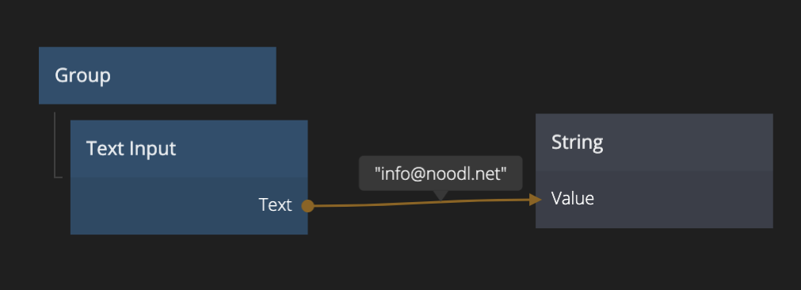

<##head##>

# Text Input

This node places a text input field in the visual tree. The input can be used to capture information from a user.

The captured value can easily be connected to other nodes in a project.

<##head##>

## Inputs

| Data                                              | Description                                                                                                                                                                                                                                                                                    |
| ------------------------------------------------- | ---------------------------------------------------------------------------------------------------------------------------------------------------------------------------------------------------------------------------------------------------------------------------------------------- |
| Text                | The text string of the Text Input node. Setting this will change the current text, unless _Set_ is connected, then it will be updated when _Set_ receives a signal.                                                                                                                            |
| Type                | The type of the Text Input.  `Text`: A single line text input (default). `Text Area`: A multi line text input. `Email`: A single line email text input. `Number`: A single line number input. `Password`: A single line password input, will mask password by default. |
| Placeholder         | The placeholder text for when the Text Input is empty.                                                                                                                                                                                                                                         |
| Placeholder Opacity | The opacity of the placeholder text. `0` is completely transparent and invisible. `1` is completely solid and opaque.                                                                                                                                                                          |

| Signal                                | Description                                                                                                                                                                                           |
| ------------------------------------- | ----------------------------------------------------------------------------------------------------------------------------------------------------------------------------------------------------- |
| Set   | Sets the text field value to the text in the _Text_ input.                                                                                                                                            |
| Clear | Clears the text.                                                                                                                                                                                      |
| Focus | Focuses the text field.  _Note_: Some browsers, most notably Safari, only allow focus if it originates from a user event, like a click. So using a Delay node or other method might not work. |
| Blur  | Removes the keyboard focus.                                                                                                                                                                           |

### Visual

This node supports the following [Visual Input Properties](nodes/ui-elements/visual-input-properties/):

-   [Margin](nodes/ui-elements/visual-input-properties/#margin)
-   [Padding](nodes/ui-elements/visual-input-properties/#padding)
-   [Alignment](nodes/ui-elements/visual-input-properties/#alignment)
-   [Dimensions](nodes/ui-elements/visual-input-properties/#dimensions)
-   [Layout, Position](nodes/ui-elements/visual-input-properties/#-position)
-   [Text Style](nodes/ui-elements/visual-input-properties/#text-style)
-   [Style](nodes/ui-elements/visual-input-properties/#style)
-   [Border Style](nodes/ui-elements/visual-input-properties/#border-style)
-   [Corner Radius](nodes/ui-elements/visual-input-properties/#corner-radius)
-   [Box Shadow](nodes/ui-elements/visual-input-properties/#box-shadow)
-   [Placement](nodes/ui-elements/visual-input-properties/#placement)
-   [Other](nodes/ui-elements/visual-input-properties/#other)
-   [Advanced Style](nodes/ui-elements/visual-input-properties/#advanced-style)

## Outputs

| Data                               | Description              |
| ---------------------------------- | ------------------------ |
| Text | The current text string. |

| Signal                                   | Description                                        |
| ---------------------------------------- | -------------------------------------------------- |
| On Enter | Signal triggered when Enter/Return key is pressed. |

It also features the standard set of UI control signals:

[filename](../shared-props/outputs/control-events/README.md ':include')

### States

Apart from triggering signals the Checkbox node also notifies of its state through data outputs:

[filename](../shared-props/outputs/control-states/README.md ':include')

### Visual

This node supports the following [Visual Output Properties](nodes/ui-elements/visual-output-properties/):

-   [Bounding Box](nodes/ui-elements/visual-output-properties/#bounding-box)
-   [Mounted](nodes/ui-elements/visual-output-properties/#mounted)
-   [Other](nodes/ui-elements/visual-output-properties/#other)

[filename](../visual-input-properties/README.md ':include')
[filename](../visual-output-properties/README.md ':include')

