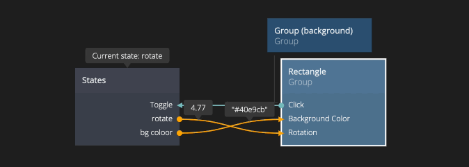

<##head##>

# States

This node is used to switch between logical states. Each state holds values that can be transitioned between. You can define as many states and values as needed.

The State node is often used to create animations on user interactions, and create state machines. Learn more in the State Node Guide.

<##head##>

To learn more take a look at the [States guide](/guides/states.md).

## Inputs

| Data                                          | Description                                                                                                                                                                                                 |
| --------------------------------------------- | ----------------------------------------------------------------------------------------------------------------------------------------------------------------------------------------------------------- |
| States          | A **States** node can have as many states as is necessary. Add a new state by clicking on the plus button.                                                                                                  |
| Values          | Every state will have its own set of values. All values need to be set for every state that is added.                                                                                                       |
| State           | <##input:state##>This input controls the current state. By setting this input to the same name as one of the available states, **State** node will change to that state.<##input##>                         |
| Use Transitions | <##input:useTransitions##>Setting this to true will turn on transitions when moving between states, while false will turn them off. <##input##> |

| Signal                                 | Description                                                                                                                                                                             |
| -------------------------------------- | --------------------------------------------------------------------------------------------------------------------------------------------------------------------------------------- |
| Toggle | <##input:toggle##>Triggering this signal will force the **State** node to move to the next state in its state list, or the first state if the current state is the last one.<##input##> |

### Value types

For each value you can specify the type. Default is **Number**.

    </img>

### State values

For every state you can specify each of the values. This is the value that they will have when you are at that specific state. You can also set the values for each state by connecting them to other nodes.

<##input:.\*##>The value of a property for a specific state.<##input##>

    </img>

### State transition

Here you specify if there should be a transition to the target state. When you switch to the given state it will transition smoothely over time. Each state has a default transition and individual transitions for **Number** and **Color** types. Use the curve editor to specify the timing for the transition.

    </img>

To learn more take a look at the [States guide](/guides/states.md).

### To state actions

Each state will have a signal input called **To** followed by the state name. This can be used to connect a signal that will take the states node to that state when the signal is triggered.

<##input:to-\*##>Triggers the **State** node to move to this state.<##input##>

## Outputs

| Data                                 | Description                                                                     |
| ------------------------------------ | ------------------------------------------------------------------------------- |
| State  | <##output:state##>The name of the current state.<##output##>                    |
| Values | All of the values for the current state and for any transitions that is active. |

<##output:.\*##>The value of the property, given the current state and transition.<##output##>

| Signal                                                     | Description                                                                                                                                                          |
| ---------------------------------------------------------- | -------------------------------------------------------------------------------------------------------------------------------------------------------------------- |
| State Changed              | <##output:stateChanged##>A signal that is sent when the current state is changed.<##output##>                                                                        |
| At `[State Name]`          | True when the currently selected state is `[State Name]`. For example, if the _State_ node has a state _Started_, it will have an output signal called _At Started_. |
| Has Reached `[State Name]` | Signal sent when the state animation to state `[State Name]` is complete.                                                                                            |

<##output:at-\*##>This value is true when this state is active, otherwise false.<##output##>
<##output:reached-\*##>This signal is sent when the specific state has been reached.<##output##>
