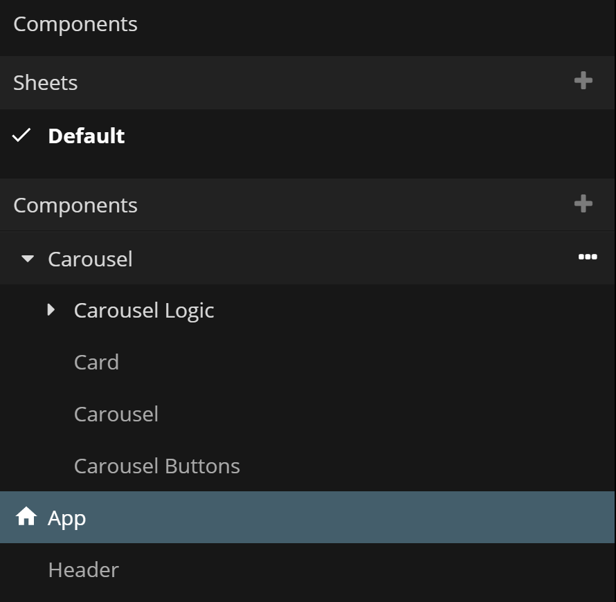
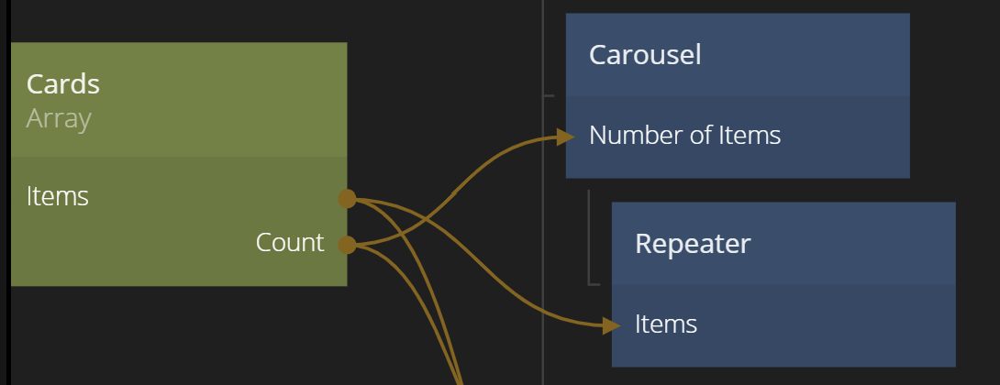
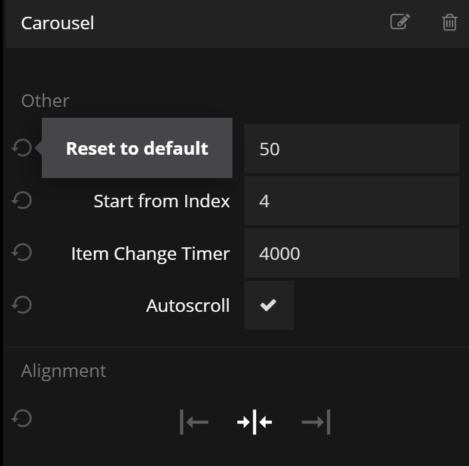
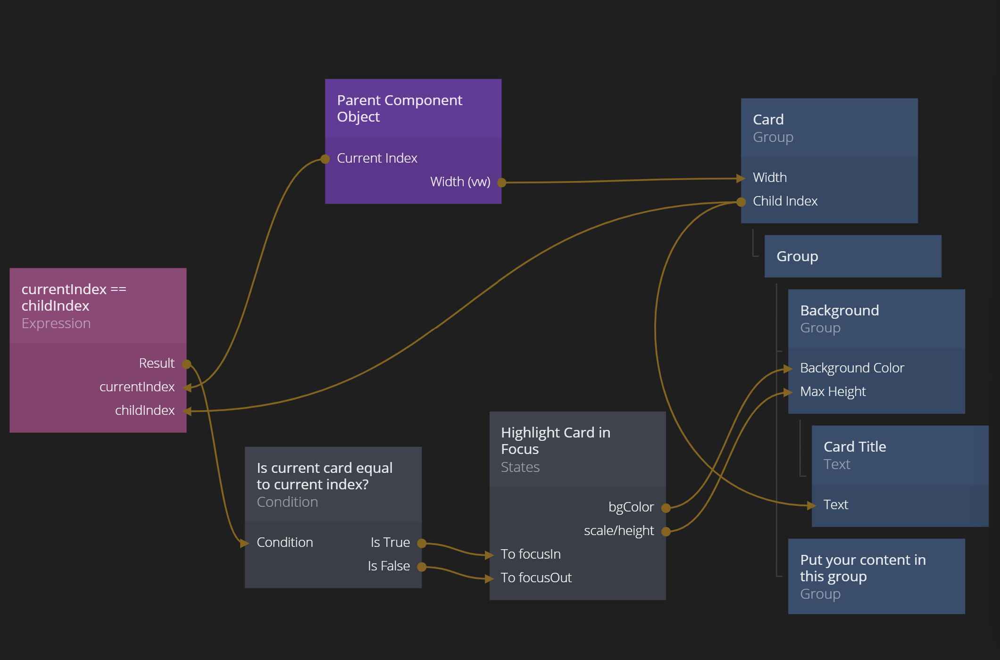

# Carousel Scroll

This snippet contains a simple horizontal Carousel scroll with the following features:
* Can be scrolled by swiping horizontally or by clicking scroll buttons
* Can auto scroll
* One selected item that can be aligned to the left, to the center or to the right
* Easy to visually modify

The snippet is packaged up as a Noodl project that can be imported. Import by pressing the "Import" button below.

    </img> 
<button class="ndl-import-button" onClick='importIntoNoodl("snippets/carousel-scroll/carousel-scroll-1-1.zip",{name:"Carousel Scroll Snippet",thumb:"snippets/carousel-scroll/carousel-1.png"})'></button>

If you need help on how to import project you can follow [this](/guides/importing/) guide.

## Overview of what's included in the import project

The project contains the following components

**App**

This is the example app using two different scrolling lists. You can use this as a starting point for your own app or remove it from your project if you don't need it.

**Header**

This component is part of the example app. Feel free to modify it or remove it if you don't need it.

**Carousel/Carousel Logic**

This folder contains the logic that controls the scrolling of the application. This is needed by the Carousel component and you should generally not modify this unless you really know what you are doing :)

**Carousel/Card**

This component is the template for the card that represents an item in the Carousel list. You should base your own Carousel item on this Card, either by modifying this directly or making a copy of it. Feel free to change the structure of the component, however it's important to keep the **Parent Component** node and have the **Width** output connected to the **Width** of the main container of the Card. Also note the selection logic if you want the Card to change appearance if it's selected.

**Carousel/Carousel**

This is the main component that represents the Carousel list. You should generally not change anything major in this component unless you know what you are doing.

Note that the **Carousel** node should have its cards as direct children. This can be achieved by either manually putting them there or using a [Repeater](/nodes/ui-elements/repeater/) node.

**Carousel Buttons**

This component the two buttons that controls left/right scrolling. Feel free to style the **Buttons** according to your liking.

## Using the snippet

You typically use the snippet by using the **Carousel** component more or less as it is and style the **Card** component to fit your app.
The **Carousel** component have a few options available to tweak.

* **Width** - This is the width of each Carousel Card in the Carousel.
* **Start from Index** - The selected index from start.
* **Item Change Timer** - The delay between each autoscroll. Will only apply if **Autoscroll** is set to **true**.
* **Autoscroll** - A boolean that controls if the list should automatically scroll to the next item whenver the **Item Change Timer** expires.

The most impactful component to change is the **Carousel Card**. You can for example keep the background color **Group** node and then add your own content as children to the **Group** named _Put your content in this group_. Another option is to rebuild the card completely but the it's important to let the width stored in the **Component Object** control the width of the card.

