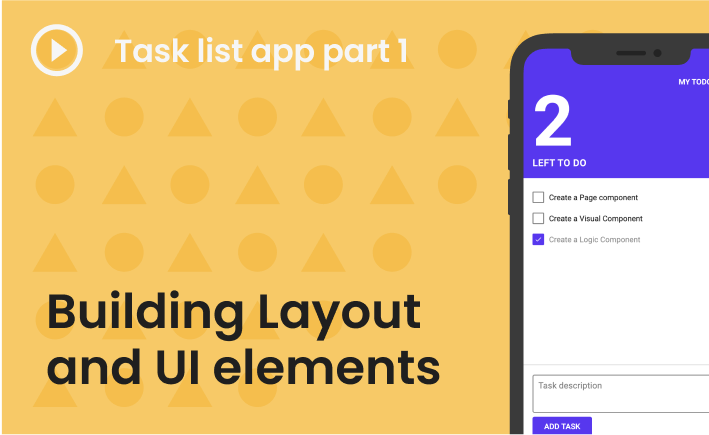
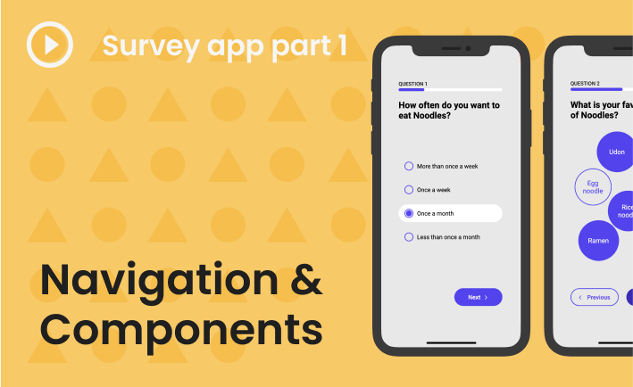

# Build your first app

Here you can find our selection of Noodl video tutorials that shows how to build different app concepts from scratch. You will see many useful patterns in these videos that can be applied to solve both similar and other problems in your own Noodl projects. 

We recommend building along in your own project while watching the tutorials.

If you are new to node based programming, or want to learn more about the editor, you may look through the [Basic Concepts](guides/basic-concepts/) guide or the [Editor Tour](/guides/editor-tour/), but it is **not** a requirement to follow along in the Task List videos below.

Happy Noodling! 

## Noodl tutorial video series
 

Build a simple task list web app with real backend from scratch, using Noodl's built-in UI controls and cloud service features.
 
 
 

 Build a multi-page survey web app that captures user data through custom-styled UI controls. 
