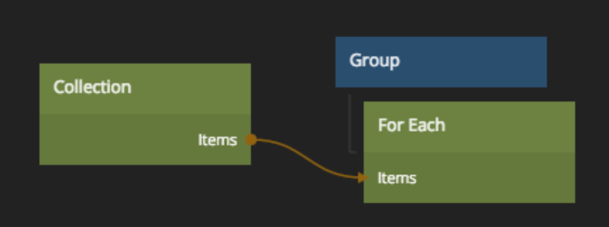

# Collection

A collection of models, mainly used together with a [For Each][0] Node.

## Inputs

### Modify
**Items**  
Sets the items in a collection. Useful when you set the data with a [Static Data][1] node.

**Item Id**  
The item id to add or remove. Unsed in conjunction with the **Add** or **Remove** inputs.

**Add**  
Add the Model with the id specified with the **Item Id** input to this collection.

**Remove**  
Remove the Model with the id specified with the **Item Id** input from this collection.

**Clear**  
Remove all models in the collection

### General
**Id**  
Set the Id for this collection. All collection nodes with the same Id will refer to the same collection and have the same items. Use the [Unique Id][3] node to generate a unique id.

## Outputs
**Id**  
The Id for this Collection

**Items**  
A `Noodl.Collection` object that can be connected to a [Javascript][2] or [For Each][0] node.

**Count**  
The number of items in the Collection

 

