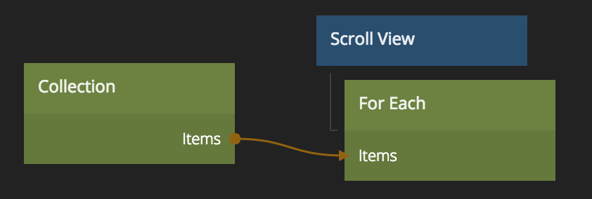

# For Each

Creates component instances for every item in a [Collection][0].
Place it as a child of a visual node, like [Group][1].

## Inputs
**Template Type**  

* **Explicit** - The same Component will be used for all items.
* **Dynamic** - Use code to choose what Component to create for each item.

**Component**  
Only visible when **Template Type** is set to _Explicit_. Choose what Component to create for each item.

**Script**  
Only visible when **Template Type** is set to _Dynamic_. Write a script to choose what Component to create for every item.

**Items**  
The Models to use to create all the Components.

**Refresh**  
Remove all created components and recreate them.

[0]: ./collection
[1]: ../visual-nodes/group

