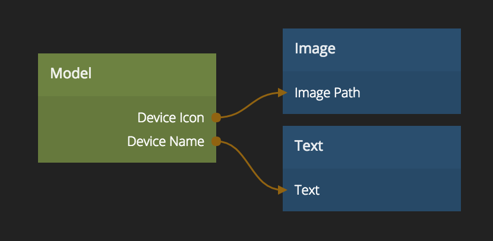

# Model

Stores any amount of properties and can be used standalone or together with [Collections][0] and [For Each][1] nodes.

## Inputs
### General

**Id**  
Set the Id for this Model. All Model nodes with the same Id will refer to the same Model and have the same properties. Use the [Unique Id][2] node to generate a unique id.

### Properties
A model can have any amount of properties. Each property will get one input to set the current value.

### Actions
**Store**  
Saves any properties that are connected to the model.

**Clear**  
Removes all properties and values from the Model.

## Outputs
### General
**Id**  
The Id for this Model

### Events
**Stored**  
Signal that is sent when new property values are stored in the Model.

### Properties
A model can have any amount of properties. Each property will get one output to get the current value.

[0]: ./collection
[1]: ./for-each
[2]: ../standard-nodes/unique-id

