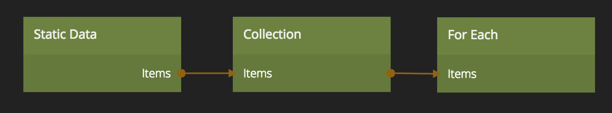

# Static Data

Store static data to populate a [Collection][0] with items.

## Inputs
**Type**  
Choose what format the data will be in.

* **CSV** - Comma-separated values
* **JSON** - Javascript Object Notation

**CSV**  
The first row defines the name of all properties. Subsequent rows defines the data values.
Example:

    lamp,topic
    Kitchen Lamp,/lamps/1
    Office Lamp,/lamps/2
    Office Lamp 2,/lamps/4

**JSON**  
Define the name of the properties, and the data, using a JSON array.
Example:

    [
        {
            "lamp": "Kitchen Lamp",
            "topic": "/lamps/1"
        },
        {
            "lamp": "Office Lamp",
            "topic": "/lamps/2"
        },
        {
            "lamp": "Office Lamp 2",
            "topic": "/lamps/4"
        }
    ]

## Outputs

**Items**  
A `Noodl.Collection` object that can be connected to a [Collection][0], [Javascript][1] or [For Each][2] node.

[0]: ./collection
[1]: ../standard-nodes/javascript
[2]: ./for-each

