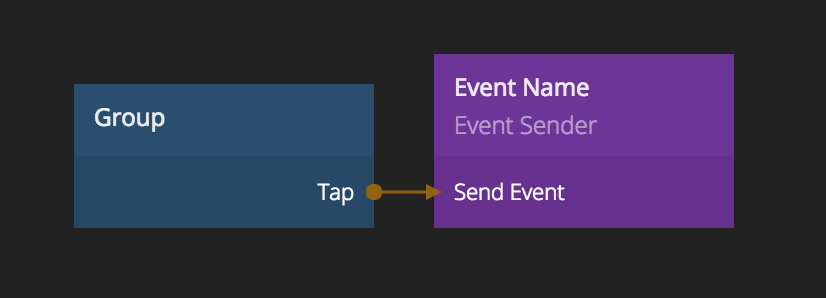

# EVENT SENDER
_Event Sender_ nodes are used to send a signal to another place in your design without having to connect the nodes directly.

Each _Event Sender_ has a _Send Event_ input that can be connected to a signal.
It also has a _Channel_ input port that can be used to specify a name that receiving nodes can reference to receive the signal.

## INPUTS
_Event Sender_ nodes can have arbitrary input ports that will be passed on to the
_Event Receiver_ nodes when the _Send Event_ signal is triggered. These ports can be added by
inspecting the node and clicking the _Add port_ button.

There may be multiple _Event Sender_ nodes with the same channel. In that case the receiving nodes
listening to the channel will get a merged set of ports from all _Event Sender_ nodes.
It's important that ports are of the same or compatible types, if not they may not show up in the receiving nodes.

**Channel name**  
The channel name can be any identifier and is used on the [Event Receiver][0] nodes to connect a sender and receiver node.

**Send Event**  
This is a signal port and when triggered the corresponding [Event Receiver][0] nodes will be triggered as well.

**Propagation**  
Controls what components the event will be sent to.

* **Global** - Send to all components
* **Parent** - Only send to the components that uses this component and their parents, all the way up to the root component.
If a component B is inside of component A, and component B sends an event, only component A will receive it.
* **Children** - Only send to the components that are used inside this component and their children.
If a component B is inside of component A, and component A sends an event, only component B will get the event.

## OUTPUTS
This node doesn't have any outputs.

[0]: ./event-receiver
