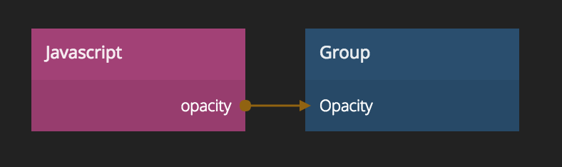

# Javascript
_Write your own code to interact with Noodl_

Javascript nodes are initialized by calling the function `define` where inputs,
outputs and the behavior of the node is specified.

<div class = "node-inputs">

## Inputs and outputs

Inputs are defined in the code by adding properties to the input object when calling define:

```
define({
    inputs: {
        nameOfInput: "type"
    },
    outputs: {
        nameOfOutput: "type"
    },
    ...
});
```

The available types are:

* _number_ - Javascript number
* _string_ - Javascript string
* _boolean_ - Javascript boolean
* _image_ - Path to an image, enables the image picker
* _color_ - A hex color, enables the color picker
* _reference_ - Reference to a Noodl node
* _font_ - Path to a font file, enables the font picker

</div>

## Setup function

This function is called once when the _Javascript_ node is created, and the inputs have been initialized. Useful for initializing state, adding event listeners, open up a websocket connection and more.

```
define({
    outputs: {
        someOutput: "number"
    },
    setup: function(inputs, outputs) {
        //initialize this output to 3
        outputs.someOutput = 3;
    },
    ...
});
```
## Run function

This function will run every time an input has changed, or if `this.runNextFrame()` has been called
```
define({
    inputs: {
        a: "number",
        b: "number"
    },
    output: {
        result: "number"
    },
    run: function(inputs, outputs, changedInputs) {
        outputs.result = inputs.a + inputs.b;
    }
});
```

## Destroy function

This function will run when the node instance is destroyed. This can be used to release 3rd party library resources.

```
define({
    inputs: {
        a: "number",
        b: "number"
    },
    output: {
        result: "number"
    },
    destroy: function(inputs, outputs) {
        // Release resources here
    }
});
```

## Javascript Node API

`run` and `setup` will be called with a `this` object that exposes the following functions

`this.runNextFrame()`  
Calls the run() function next frame even if the inputs doesn't change

`this.flagOutputDirty("outputName")`  
If an output is changed asynchronously you currently have to tell Noodl that it has changed. E.g. when using setTimeout, event listeners on WebSockets, XMLHTTPRequests etc.

`this.sendSignalOnOutput("outputName")`  
Sends a signal, which is a boolean that briefly goes from false to true, and back again. Used for toggling switches, triggering animations etc. Can only be used on outputs of type boolean.

## Additional APIs
Make sure to check out the API Reference section in the documentation

## Examples


