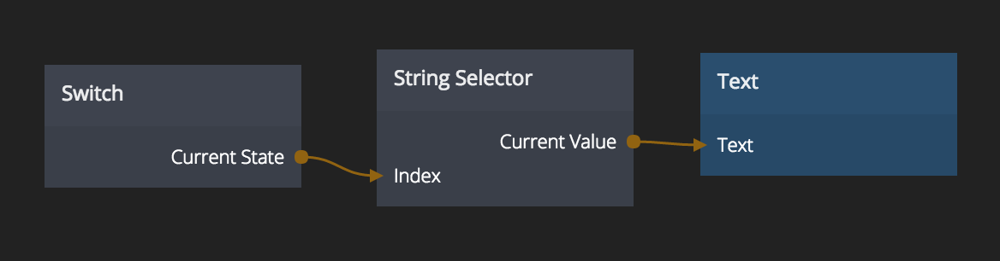

# String Selector
Choose between multiple strings

## Inputs
**Input 0..N**  
The strings to choose between. When an input is added a new one will be created automatically

**Index**  
The index of the string to choose

## Outputs
**Current Value**  
The currently selected string

**Index Changed**  
A signal that is emitted when the *Index* input value is changed

