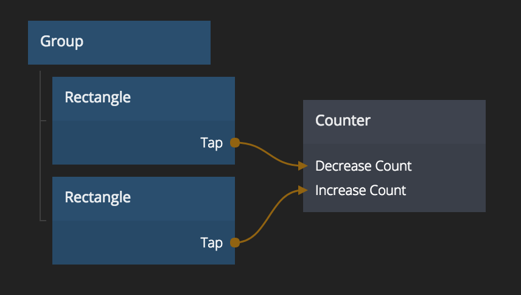

# Counter
A number that can be increased and decreased with signals

## Inputs
**Increase Count**  
Increases the count by one

**Decrease Count**  
Decreases the count by one

**Reset To Start**  
Resets to count to the *Start Value*

**Start Value**  
The start value of the count. Defaults to zero.

### Limits
**Min Value**  
The counter will never decrease below this value

**Max Value**  
The counter will never increase above this value

**Limits Enabled**  
Controls if the limits above are active or disabled

## Outputs
**Current Count**  
The current count

