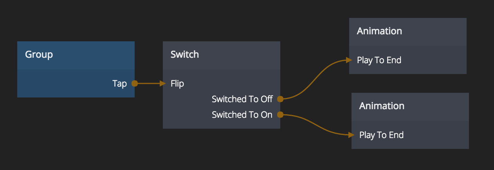

# Switch
A boolean state that can be either on or off

## Inputs

### Change state
**On**  
Sets the state of the Switch to *On*

**Off**  
Sets the state of the Switch to *Off*

**Flip**  
Set the Switch to the opposite state. If it's *On* flip will set it to *Off* and vice versa

### Start State
**Start State**  
The starting state of the Switch. If the *Start State* is set to *On* then the *Switched To On* output signal will trigger instantly when applications starts, or when a component is created dynamically.

## Outputs
**Current State**  
Outputs *True* or *False* depending on if the Switch is *On* or *Off*

**Switched To On**  
This signal is triggered when the Switch goes from *Off* to *On*

**Switched To Off**  
This signal is triggered when the Switch goes from *On* to *Off*

