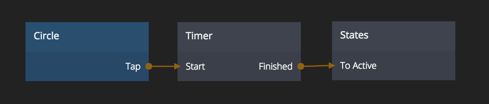

# Timer

A timer that can be used to delay actions.

## Inputs

**Start**  
Starts the timer. Does nothing if the timer is already running.

**Restart**  
Starts the timer. Restarts the timer if the timer is already running.

**Duration**  
The duration of the timer in milliseconds.

**Start Delay**  
The delay before the timer starts after the _Start_ input is triggered. Specified in milliseconds.

**Stop**  
Stops the timer if it's running. Does nothing otherwise.

## Outputs

**Started**  
Signal emitted when the timer starts.

**Finished**  
Signal emitted when the timer is finished.

